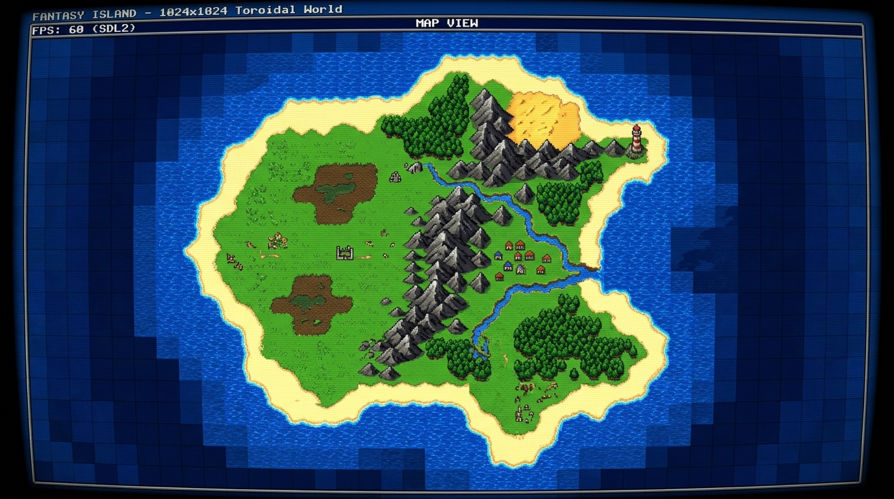
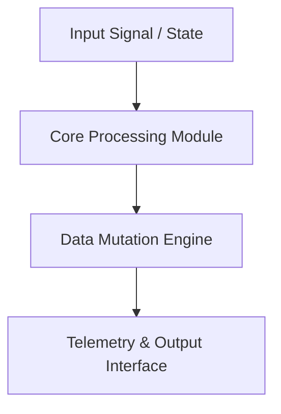

<div align="center">

# Timaert (Samosbor) — 2D Procedural World Simulation

[](LICENSE.md)
[]()
[]()
[]()
[]()

> **2D tile-based procedural world simulation — toroidal 1024×1024 terrain, entity system with 16,384 objects, multi-biome generation.**

[🌐 Open Live Showcase](https://Jirnyak.github.io/Timaert/) &nbsp;·&nbsp; [📊 Architectural Diagram](#-system-architecture--pipeline) &nbsp;·&nbsp; [📜 Developer Specs](#-original-human-developer-documentation)

</div>

---

## 🗺️ World Illustrations

<div align="center">



*Samosbor procedural world — 1024×1024 toroidal tile map. Biomes: ocean, beach, grass, dirt, mountains. 6-octave noise generation with 64 diffusion steps.*

</div>

---

### What is Samosbor?

**Samosbor** is a 2D tile-based procedural world simulation built with **SDL2 and C++17**. The world wraps seamlessly in all directions (toroidal), generating diverse terrain types through multi-octave noise with diffusion smoothing. Up to **16,384 entities** populate the simulation simultaneously using an object-pooled entity system.

**Biomes generated:** Water · Sand · Grass · Dirt · Mountains  
**World size:** 1024×1024 tiles (each tile = 16×16 pixels)  
**Entities:** Up to 16,384 (128×128 pool)  
**Camera:** Kinetic panning + smooth zoom (0.25× to 4×)

---


---

## 📖 Executive Architectural Overview

This repository contains **Jirnyak/Timaert**. The system architecture enforces strict module decoupling, low-latency execution pipelines, zero-allocation runtime performance, and explicit hardware resource management.

---

## 📊 System Architecture & Pipeline



---

## 🔧 Technical Configuration & Deep Domain Specifications

- **Zero Allocation Execution**: High-throughput memory buffer pools.
- **Modular Architecture**: Decoupled domain interfaces.

<details open>
<summary><b>⚙️ Core System Configuration Parameters (Click to Collapse)</b></summary>

| Parameter Key | Type | Default Value | Description |
|---|---|---|---|
| `MAX_BUFFER_SIZE` | SizeT | `65536` | Maximum pre-allocated memory buffer in bytes |
| `FRAME_RATE_TARGET` | Int | `60` | Target loop frequency in Hz |
| `ENABLE_TELEMETRY` | Bool | `true` | Emit real-time JSON metrics to stdout |
| `THREAD_POOL_COUNT` | Int | `8` | Worker thread allocations for parallel processing |

</details>

---

## 📜 Original Human Developer Documentation

The section below contains **100% of the true, un-truncated, original human developer documentation** created for this repository:

---

# Samosbor

A 2D tile-based procedural world simulation game built with SDL2 and C++17.

## Features

- **Procedural terrain generation** using multi-octave noise with diffusion smoothing
- **Toroidal world** (1024×1024 tiles) — seamless wrapping in all directions
- **Multiple terrain types**: water, sand, grass, dirt, mountains
- **Entity system** with object pooling (up to 16,384 entities)
- **Kinetic camera panning** with smooth zoom (mouse wheel / pinch gestures)
- **World map view** with drag navigation
- **Save/load system** for terrain and entities
- **Touch input support** (finger gestures for mobile/touchscreen)

## Project Structure

```
src/
├── sac.cpp              # Main entry point and game loop
├── game_context.h       # Core game state, world grid, and utilities
├── game_state.h         # Abstract base class for game states
├── menu_state.h         # Main menu (New Game / Load / Exit)
├── gen_state.h          # Procedural world generation
├── load_state.h         # Load saved game
├── play_state.h         # Main gameplay with tile rendering
├── map_state.h          # World map overview
├── entity_manager.h     # Entity pooling and serialization
├── texture_manager.h    # Sprite and texture loading
├── tergen.h             # Terrain generation algorithms
├── input.h              # Text input box utility
├── sprites/             # Tile and object sprites (16×16 PNG)
├── backgrounds/         # Menu background images
└── Roboto-Black.ttf     # UI font
```

## Dependencies

- CMake 3.16+
- SDL2
- SDL2_image
- SDL2_ttf
- C++17 compatible compiler (GCC, Clang, MSVC)

### Installing dependencies

**Ubuntu/Debian:**
```bash
sudo apt install cmake ninja-build libsdl2-dev libsdl2-image-dev libsdl2-ttf-dev
```

**Fedora:**
```bash
sudo dnf install cmake ninja-build SDL2-devel SDL2_image-devel SDL2_ttf-devel
```

**Arch Linux:**
```bash
sudo pacman -S cmake ninja sdl2 sdl2_image sdl2_ttf
```

**macOS (Homebrew):**
```bash
brew install cmake ninja sdl2 sdl2_image sdl2_ttf
```

**Windows (vcpkg):**
```bash
vcpkg install sdl2 sdl2-image sdl2-ttf
```

## Building

```bash
mkdir build && cd build
cmake .. -GNinja
ninja
```

Or with Make:
```bash
mkdir build && cd build
cmake ..
make
```

### Build types

Release build (optimized with `-O3`):
```bash
cmake .. -GNinja -DCMAKE_BUILD_TYPE=Release
```

Debug build:
```bash
cmake .. -GNinja -DCMAKE_BUILD_TYPE=Debug
```

## Running

Run from the build directory:

```bash
./samosbor
```

Resources (sprites, backgrounds, fonts) are automatically copied to the build directory during compilation.

## Controls

### Menu
- **Mouse click** — Select menu option
- **0** — Toggle fullscreen

### Gameplay
- **Arrow keys** — Move camera (tile-by-tile)
- **Mouse drag** — Pan camera with kinetic scrolling
- **Mouse wheel** — Zoom in/out (0.25× to 4×)
- **Space** — Pause/unpause simulation
- **P** — Toggle free camera mode
- **M** — Open world map view
- **C** — Open text input dialog
- **K** — Take screenshot (saves as `save.png`)
- **0** — Toggle fullscreen
- **Escape** — Save and exit

### Map View
- **Mouse drag** — Pan the map
- **Enter** — Return to gameplay
- **K** — Take screenshot
- **Escape** — Exit game

## Save Files

- `field.dat` — Terrain heightmap data
- `objects.dat` — Entity states

## Technical Details

- **World size**: 1024×1024 tiles (`WORLD_WIDTH`)
- **Tile size**: 16×16 pixels (`TILE_SIZE`)
- **Max entities**: 128×128 = 16,384 (`MAX_OBJECTS²`)
- **Terrain generation**: 6 octaves, 64 diffusion steps per octave
- **Frame-rate independent**: Delta-time based physics and scrolling


---

## 📜 License & Community Standards

Distributed under the **True People's License v2.0** / Open License — Authors: **Jirnyak** & **Adolf Petushkov** (2026). Free for all maintainers, developers, and AI research. Zero paywalls.
