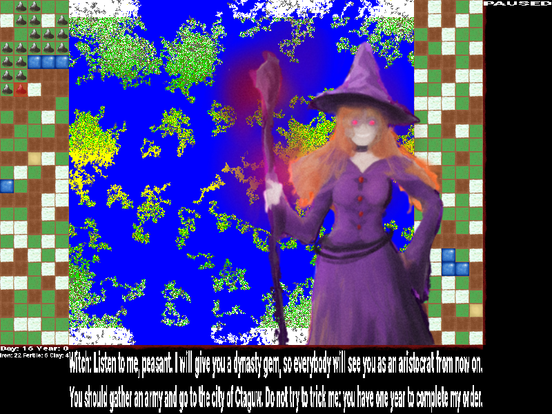
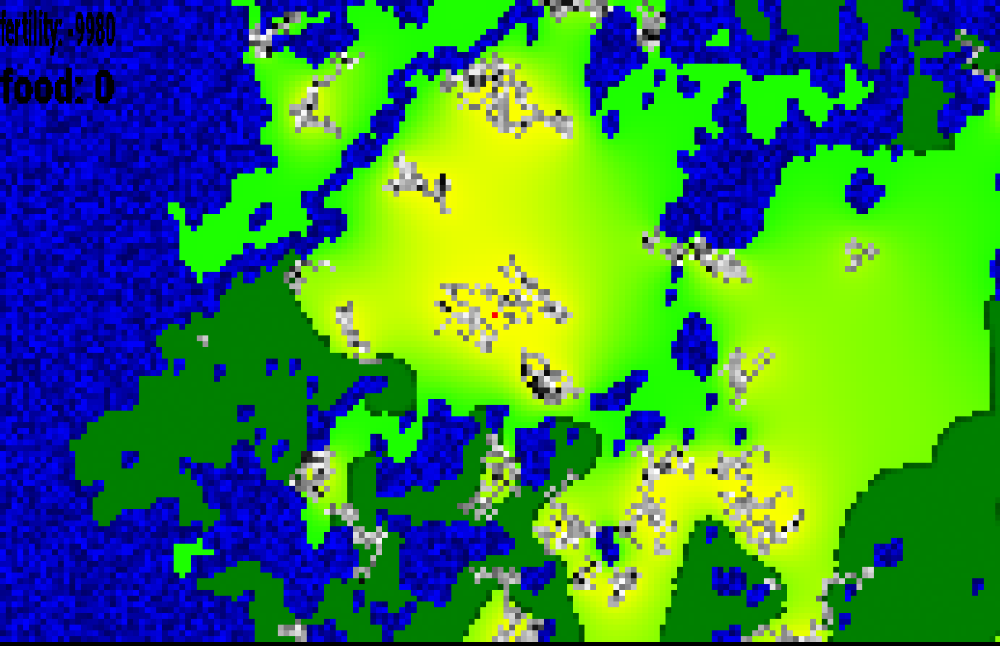
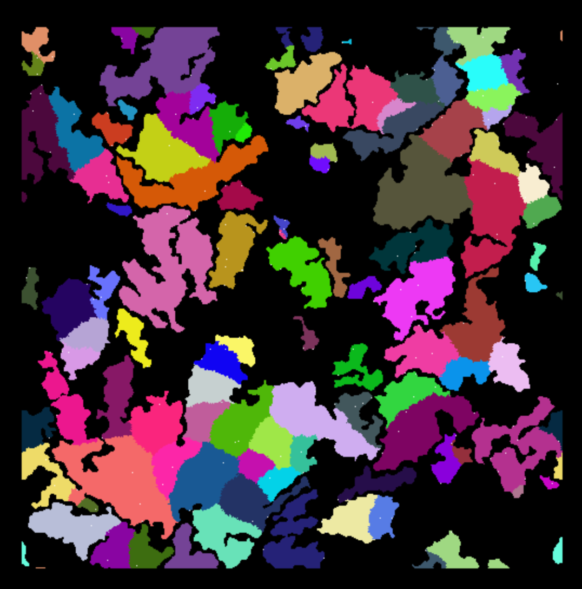

# Abstract

\"Might of Timaert\" is an indie 2d procedural RPG with tile graphics.
Game engine is based on cellular automata with a \"real time\" (game
tick/10 $us$) world simulation. Cellular world is connected 1024x1024
array of cells with torus topology. All the physics (zones, fluids,
climate etc.) is simulated on ancilla arrays. All the world objects are
dynamically linked to relevant cells. It is expected to subsequently
have an order of $10^4$ individual active game objects. Menus, fights,
quests and others player-game interactions are realised using finite
automata world states.

Games references:
$mount-and-blade, dwarf-fortress, caves-of-qud, Elona+, fear-and-hunger$

Contact email: <jirnyak@gmail.com> Telegram:
[`@mankobus`](https://t.me/mankobus) GitHub:
[`Jirnyak`](https://github.com/Jirnyak)

<figure id="fig:witch" data-latex-placement="H">

  

<figcaption>1. An example of in game procedural quest. 2. An example of
climatic zones. 3. An example of political map. Screenshots from game
prototype.</figcaption>
</figure>

Download game prototype:
[`drive.google.com`](https://drive.google.com/drive/folders/1TWdjQCXN2TFRXHNwMoggdR0XF6cGWThE?usp=sharing)

# Introduction

Might of Timaert simulates a large-scale single-player open world game
with persistent landmarks and emergent behaviours (similar to Mount &
Blade-style campaign world simulation). The design separates the global
strategic layer (map, kingdoms, resources, population) from turn-based
tactical fights and action, and real-time landmark exploration.

Introduction will cover central game ideas and systems, and the next
sections will expand each main system in detail - RPG Mechanics
[3](#sec:RPG){reference-type="ref+label" reference="sec:RPG"}, Economics
[4](#sec:economics){reference-type="ref+label"
reference="sec:economics"}, Politics, Lore, Events(\"Quests\"), Global
World, Local World, Fight Mode, AI, and Gameplay. Also, Spells, Skills,
Perks, Monsters and Artefacts lists are attached.

<figure id="fig:example" data-latex-placement="H">

<figcaption>A test image.</figcaption>
</figure>

$$\begin{equation}
    E = mc^2
    \label{eq:example}
\end{equation}$$

## Core Concepts

### Global World:

is a 1024x1024 cells toroidal manifold. Most game is spent in a global
regime where player, NPCs and different creatures (peasants, caravans,
bandits, demons, pilgrims, armies) are travelling between cities and
landmarks or gathering resources. It is a connected world map where
nature (forests, climate, resources), economics (cities, villages,
caravans) and politics (kingdoms, armies, wars) are simulated in real
time. Time passes in hours in the Global World. Seed is used to generate
the Global World. There could potentially be many different global
worlds, which are generated and stored as saved data and accessed when
the player enters a specific world. It is expected to take tens of game
years for a player in the Global World for an average playthrough. If
around 60 FPS, one IRL second will be one hour of game time. The game
could be paused in the Global World at any time, but real time linear
flow of game ticks simulation if not. One year is 365 in-game days, so
it will take around 20 hours of real-time gameplay for an average 10
years walkthrough, but the game speed could be increased.

References: mount and blade, civilization, crusader kings.

### Cell

The smallest unit of the strategic global world grid. Contains position
data and holds objects, terrain type, resources arrays, faction owner
politic map info, and danger zone levels. 2 D cellular connected world
is inspired by the Lattices and Ising chains model in physics. Cellular
structures are used for many emergent simulations and systems:

- **Resources** arrays. Each cell is mapped by a number of any resource
  deposited inside (usually 0). Resources are divergent and distributed
  unevenly. Economic.

- **Factions** arrays. Each cell is mapped by a number representing the
  political owner faction. It creates a political map of the world. The
  owner of the cell owns a Landmark in it and its taxes and resources.
  Politics.

- **Level zone** array. Each cell is mapped by a zone difficulty level
  number, which changes over game and time evolutions and as a function
  of landmarks and other systems. For example, there are lower-level
  zones around cities and higher-level zones around ruins. Also,
  different parts of the Global World have naturally different
  difficulties. Zone level affects RPG aspects such as enemies,
  encounters, ambushes prob, loot quality, and exp coefficients. RPG.

- Local **event** threads. Most of the events in the game are local and
  read only by adjacent coordinates.

### OBJ

Any interactive, unique entity in the world: player, NPCs, caravans,
armies, spell effects (portals, meteors), or landmarks (villages,
cities, ruins). Objects are managed by the ENTT system. Every object has
its own parameters, such as name, economy value, and RPG attributes.
Each object also has its own inventory array. For example, peasants or
caravans carry resources and goods. Cities and Landmarks stock resources
and different items. Locan World can place items from the Landmark
inventory inside for the player to potentially collect.

### Landmark

A persistent, typically non-movable object, such as cities, castles,
ruins, or monster dens. Landmarks can change state, be created, or
destroyed, but such events are rare. Landmarks are the main anchors of
gameplay - RPG, economic, politics and quests hubs. A player or NPC can
create their own Landmark if the specific conditions are fulfilled. Here
is a list of the most important Landmarks:

- **Villages** generated near large resource deposits. Spawn peasant
  squads who gather resources and supply adjacent cities in exchange for
  small gold. Provide quests.

- **Cities** generated as a centre of mass of a set of villages.
  Accumulate resources and produce goods, caravans, armies and taxes for
  the owner faction. Provide many quests.

- **Castles** generated on political borders. Spawns armies of the owner
  faction. Home for powerfull NPC and quests.

- **Ruins** generated far from cities and villages. Spawns cultists and
  hold powerfull procedural black artefacts. Target of quests and dark
  corruption mechanics - ruins spread corruption, increasing the level
  of the zone over time.

**Game state**

A specific game mode gives information to the player (map, stat screen)
or allows interactions with the world. A UI style for game state screens
are dark, warm beige-reddish palette to give a dark medieval
paper-wooden feel.

- **Main menu** - the first thing the player sees when running the game.
  Here player can start a new game, load a saved one, do a detailed
  world generation setup and exit the game. Later homologous menu could
  be opened in-game for saving, loading, restarting, and exiting
  purposes.

- **Game screen** - a render of a zoomed-in or out fragment of the
  Global World. Different interface buttons, such as stat, menu, and
  interaction buttons. Essential UI such as current player HP, MP, and
  SP resources. Most other UI and states are popping on top of the Game
  Screen.

- **Character creation** - when starting a new game, a player can choose
  a name, sex, class (initial skills) and portrait for their new
  character. Birth options will affect where the player starts
  geographically (climate zones, near water or mountains, owner
  territories - Magica, Empire, Timaert, Barbaric). Lore.

- **Stat screen** - a UI multibox of all the Player object parameters,
  including RPG, inventory and politics systems. Here also the player
  can check and reorganise inventory, spend skill, atrribute and perk
  points. RPG.

- **Map mode** - a full map render of the Global or Local World map
  (depedning of where the player is present at the moment). By default,
  the Map will be obscured from the player by unseen flags on
  non-visited far cells, to stimulate the player's exploration instinct.
  Additionally, it also have resources depositions modes and politic
  map. Resources are also obscured, or their numbers are rounded, but
  could be shown with greater accuracy if the player has specific skills
  (prospecting, scouting, etc.) Exploration, Politics and Economics.

- **Interaction mode** - universal hub for interobject and player-object
  interactions when nearby in the Global World. Allows a list of options
  to Talk, Trade, Quest, Fight, and Leave states calls. Intercation mode
  is also simulated as a finite automata state model for object-object
  interactions during the simulations - for example, bandits extorting
  money from peasants or plot-driven NPC interactions during the Global
  World simulation. A pair of particle interaction event as in physics
  in game space-time.

- **Fight mode** - Important part of gameplay, Player object will face
  symmetrical in terms of RPG mechanics in game object and use tactics,
  items, spells, and build optimisation to slay the enemy. Uses RPG
  mechanics. The player can flee from the fight and use many different
  active spells(skills). Most enemy faction members will initiate fight
  mode with the player regardless of what options in interaction mode
  the plyer chosen. If the player has chosen to fight with a neutral
  object, the owner faction's relation with the player will decrease.
  Weaker objects will try to flee or buy out. Stronger objects will be
  more aggressive. Some builds are fight mode oriented, others are more
  economy and political or exploration focused (this comes from RPG
  attributes and skills distributions). Usually, fighting is the main
  source of EXP and LOOT. Fight mode is also simulated for object-object
  interactions behind the scenes during the Global World simulation.
  RPG.

- **Trade mode** - Inventory exchange mode. Where the player and object
  or landmark or object-object could barter any items from their
  inventories. It depends on RPG and economics, and also each in-game
  item, such as resources, goods, gold or arms, has an absolute value
  parameter which guides pricing together with the economics system.
  Economics.

- **Landmark mode** - while the player is in a landmark cell shows
  information about the landmark, for example, city owner faction flag,
  city map, population, quests, etc. The player can also visit Landmark
  and any other cell, but usually the Local World of Landmark will be of
  special interest. Anchors.

- **Local mode** - A procedurally or precreated real-time action 2d area
  of size 1024x1024. It is used for exploration (dungeon maps,
  labyrinths), quests (find a specific person in a city, find artifact
  in a labyrinth) and decorative purposes (city population is roaming on
  the streets). EXP gains are reduced to minimal or non-existent in a
  Local World. Game time is frozen for balance and immersion purposes.
  Used for quests. Seed is used to generate Local World, and it is
  usually generated dynamically from Global World parameters (the city
  map is generated from a Landmark population). subgame with action
  real-time movement on a gridless space in order to explore, pixel hunt
  for quests (for example, char sprites of specific features),
  artefacts, and fun genocide of the local population, which is, of
  course, punishable by Global fight with guards. A player can walk
  around living city streets with thousands of living sprites, explore a
  labyrinth or build their own base in the wilderness (will store local
  map data on players pc). Fun and decoration.

- **Event mode** - a pop-up of original non-repeating random event,
  procedural event from local game variables (zone level, objects,
  economics, politics, etc.) or game state. Usually contains text
  messages for lore and plot, and sometimes choice option buttons which
  will affect the outcome and any in-game variables (for example, player
  stats). Quests.

- **Event log** - A list of all event history with in-game date when it
  happened to the player for both information and immersion purposes.
  Journal.

### Factions

The world can contain max 128 distinct factions, including lore
factions:

- Shattered Magica Kigdoms - Old Magica, Northern Magica, Southern
  Magica, Central Magica. North West.

- Huge centralised - Empire of Light. Equator.

- Small feudal - Barbaric Kingmods. North East.

- Trade Republic of Timaert. South or behind the sea.

- Dark Cults (minor factions)

- Bandits (minor factions)

- Wilderness (minor factions)

- Uprised Peasants (minor factions)

- Witches (Demiurgs) (Plot factions)

- Potentially - Player-owned created faction.

Each kingdom has variables:

- Name, flag.

- Occupies contiguous territories on the political map.

- has its own gold capital collected from owned landmark taxation.

- Spawns units (armies, agents, bosses npcs).

- Has diplomatic relations with all other factions, $[-127, +127]$
  Alliance from + 100 (fight common wars), Trade from + 50 (send
  caravans), Neutral around 0, Aggression -50 (border confilcts), Total
  War -100 (send occupation armies).

- Total population.

- Key NPCs Leaders (lords).

- Own Landmarks.

### Difficulty Zones

Zone difficulty increases gradually over long-term game time (years) to
preserve progression pressure.

Higher-level landmarks and corrupted territories influence nearby cell
difficulty values.

Plot events can significantly change zone difficulties in specific
areas.

## Game Time

- Primary simulation tick: 1 in-game minute.

- 365 days per in-game year.

- Entities age annually. Human NPCs and even players could die at old
  age if significant time has passed (chance to die after age \> 60).

- Landmark population updates once per year

Movement speed is object RPG stats dependent and the movement in Global
Mode consumes SP basing on cell terrain weight. The average traversal
time of one global tile is approximately one in-game day, though fast
units may cross in one hour. Population growth in cities and villages
follows a logistic-style model
[\[eq:sigmoid\]](#eq:sigmoid){reference-type="ref+label"
reference="eq:sigmoid"}:

$$\begin{equation}
P_{t+1} = P_t + rP_t \left(1 - \frac{P_t}{K} \right)
 \label{eq:sigmoid}
\end{equation}$$

where $r$ is the growth coefficient and $K$ is the carrying capacity
(around one million pop cap).

# RPG Mechanics {#sec:RPG}

A performance-first RPG architecture designed to be universal for all
entities (players, NPCs, enemies).

Character progression is driven by:

- Classes --- determine starting skills; additional skills learned
  during playthrough

- Levels --- grant attribute points, skill points and perk points.

- Fame --- political and economic power (owned territories, capital,
  deeds)

The system is structured into five core layers:

1.  Attributes --- percentage multipliers and event check determinants

2.  Skills --- flat base bonuses and tactical unlocks

3.  Spells --- magic abilities and effects

4.  Items --- weapons and artifacts with bonuses

5.  Perks --- strong specialization modifiers

## Resources

   Resource        Purpose                 Critical State
  ---------- -------------------- --------------------------------
      HP            Health           $\leq 0 \rightarrow$ Dead
      MP        Spell casting           Cannot cast if empty
      SP      Actions / Movement   $\leq 0 \rightarrow$ HP damage

Primary governing attributes:

- HP $\rightarrow$ END

- MP $\rightarrow$ WIL

- SP $\rightarrow$ SPD

## Attributes

Nine primary attributes:

   Attribute                        Effect
  ----------- ---------------------------------------------------
      STR              +1% physical damage; carry weight
      END                 +1% HP regen; increases HP
      AGI                     +1% SP regen; dodge
      WIL                 +1% MP regen; increases MP
      INT      +1% spell damage; +1 active spell slot per point
      WIS        +1% EXP gain; +1 learned spell slot per point
      LCK                 Improved loot; crit chance
      CHA               +1 relation; −1% trade tariffs
      SPD      Movement speed scaling (asymptotic); increases SP

## Level and Experience System

Level data:

- $level$

- $exp$

- $exp\_to\_next$

- $skill\_points$

### Level Rewards

Per level:

- +3 Skill Points

- +3 Attribute Points

- +1 Perk Point every 10 levels

Starting at level 1:

- 9 Attribute Points

- 5 Skill Points

- 1 Perk Point

- 3 Class skills

### Experience Formulas

$$\begin{equation}
EXP_{next}(lvl) = 1000 \cdot lvl \cdot (0.1 \cdot lvl + 1)
\end{equation}$$

$$\begin{equation}
EXP_{fight}(lvl_m, k) = 10 \cdot lvl_m \cdot k
\end{equation}$$

$$\begin{equation}
EXP_{quest}(lvl_q, k) = 100 \cdot lvl_q \cdot k
\end{equation}$$

Where:

- $k$ --- difficulty modifier

- $lvl_m$ --- monster level

- $lvl_q$ --- quest level

## Combat Stats

### Hit Points

$$\begin{equation}
HP(HP_0, END) = HP_0 \cdot (1 + 0.1 \cdot END)
\end{equation}$$

Base HP: 100

### Mana Points

$$\begin{equation}
MP(MP_0, WIL) = MP_0 \cdot (1 + 0.1 \cdot WIL)
\end{equation}$$

Base MP: 10

### Stamina Points

$$\begin{equation}
SP(SP_0, SPD) = SP_0 \cdot (1 + 0.1 \cdot SPD)
\end{equation}$$

Base SP: 100

### Regeneration

$$\begin{equation}
HP_{regen} = base\_hp\_regen \cdot (1 + 0.1 \cdot END)
\end{equation}$$

$$\begin{equation}
MP_{regen} = base\_mp\_regen \cdot (1 + 0.1 \cdot WIL)
\end{equation}$$

$$\begin{equation}
SP_{regen} = base\_sp\_regen \cdot (1 + 0.1 \cdot AGI)
\end{equation}$$

## Derived Bonuses

$$\begin{align}
phys\_damage\_mult &= 1 + 0.01 \cdot STR \\
spell\_damage\_mult &= 1 + 0.01 \cdot INT \\
hp\_regen\_mult &= 1 + 0.01 \cdot END \\
mp\_regen\_mult &= 1 + 0.01 \cdot WIL \\
sp\_regen\_mult &= 1 + 0.01 \cdot AGI \\
exp\_mult &= 1 + 0.01 \cdot WIS \\
move\_speed\_mult &= 1 + \frac{SPD}{SPD + 50} \\
trade\_discount &= 0.01 \cdot CHA \\
relation\_bonus &= CHA
\end{align}$$

## Combat Probabilities

Dodge:

$$\begin{equation}
dodge = \frac{AGI_{def}}{AGI_{def} + AGI_{att} + K}
\end{equation}$$

Critical hit:

$$\begin{equation}
crit = \frac{LCK_{att}}{LCK_{att} + LCK_{def} + K}
\end{equation}$$

## Skills

Skills:

- Provide flat base bonuses

- Do not modify attributes

- Do not apply percentage multipliers

- Scale linearly

Final stat calculation order:

$$\begin{equation}
FinalStat =
(Base + \sum SkillBase + \sum ItemBase)
\times AttributeMultipliers
\times SituationalMultipliers
\end{equation}$$

## Example Skills

### Bodybuilding

$$\begin{equation}
BaseHP = BaseHP_0 + Bodybuilding
\end{equation}$$

### Swordsman

$$\begin{equation}
BaseWeaponDamage = BaseWeaponDamage_0 + Swordsman
\end{equation}$$

$$\begin{equation}
BaseSP_{cost} = BaseSP_{0} \cdot (1 - 0.005 \cdot Swordsman)
\end{equation}$$

Certain skills and spells affect both Global and Tactical layers.

Examples:

- Scouting increases map visibility (scout vision, scavenge resources).

- Strategic spells may alter the landmark state or cell types
  (armageddon).

- Tracking (show obj suqads tracks - tracks map array over cells)

## Spells

Spells consume mana and could be generalised as \"active skills\". Spell
damage scales with mana invested.

Example: Fireball

- Base: 10 damage for 10 mana

- Each additional 10 mana increases base damage by +10

This allows flexible scaling depending on build and resource
availability.

### Travel

$$\begin{equation}
BaseSP_{cost} = BaseSP_{0} \cdot (1 - 0.01 \cdot Travel)
\end{equation}$$

## Perks

- Strong and build-defining

- Contain advantage and a disadvantage

- Permanent choice

- 1 perk at level 1

- +1 every 10 levels

Full perk list is provided in
[\[sec:perks\]](#sec:perks){reference-type="ref+label"
reference="sec:perks"}.

# Economics {#sec:economics}

A performance-first economic simulation for a fantasy RPG world,
designed to be **universal for all settlements and factions**. The
system is modular, extensible, and supports emergent trade, local
markets, and dynamic political control.

## Core Components

### World Grid

      Property             Description
  ----------------- --------------------------
        Size         1024 $\times$ 1024 cells
   Cell Properties   terrain, resources, cost
   Resource Fields      Modular, see below

#### Resource Fields

Each cell:

$$\begin{equation}
R_{cell} = \{ r_1, r_2, ..., r_n \}
\end{equation}$$

Each resource:

$$\begin{equation}
r_i = (type, amount)
\end{equation}$$

   Resource        Notes
  ----------- ----------------
     Iron     
   Fertility   Crop potential
     Clay     
     Wood          trees
     Gold     
     Water    
     Coal     
     Gems     
      Fur     

## Landmarks

    Type               Description
  --------- ---------------------------------
   Village   Resource gathering, local trade
    City       Production, trade, politics

Each landmark:

$$\begin{equation}
L = (population, inventory, location, production\_capacity)
\end{equation}$$

## Population System

Population drives:

- Unit spawn rate

- Production/consumption

- Caravan count

### Population Growth (Logistic)

$$\begin{equation}
P_{t+1} = P_t + r \cdot P_t 
\left(1 - \frac{P_t}{K}\right) \cdot F \cdot S
\end{equation}$$

   Symbol           Meaning
  -------- -------------------------
   $P_t$      Current population
    $r$     Growth rate (e.g. 0.01)
    $K$     Carrying capacity (1M)
    $F$     Food sufficiency $0-1$
    $S$         Stability $0-1$

If $F$ or $S$ is low, growth slows or reverses.

### Spawn & Production

     Output                Formula
  ------------- -----------------------------
    Peasants       $k_p \cdot Population$
    Caravans       $k_c \cdot Population$
   Production    $k_{prod} \cdot Population$
   Consumption   $k_{cons} \cdot Population$

Initial balance:

$$\begin{equation}
k_{cons} \approx \frac{1}{10} k_{prod}
\end{equation}$$

## Villages

       Function             Description
  ------------------ -------------------------
   Gather resources   Peasant squads assigned
   Store inventory         Local storage
     Sell/deliver       To caravans/cities

#### Extraction per tick

$$\begin{equation}
Extracted = BaseGatherRate \cdot SkillCoef \cdot CellDensity
\end{equation}$$

## Cities

      Function                Description
  ---------------- ---------------------------------
   Buy resources    From villages/caravans/peasants
   Produce goods         See production chains
   Spawn caravans              For trade

City specialization --- labor allocation production percentage of
population.

### Taxation & Politics

      Concept                             Formula / Description
  ---------------- -------------------------------------------------------------------
     City gold      $Gold_{city} = \alpha \cdot Population + \beta \cdot TradeVolume$
      Tax paid               $Gold_{tax} = Gold_{city} \cdot TaxPercentage$
   Faction income          $Gold_{faction} = \sum_{i \in cities} Gold_{tax,i}$
     Ownership                      Each cell/landmark: owner_faction

Faction gold can be used for diplomacy, armies, development, etc.

### Production Chains

$$\begin{equation}
k_1 \cdot Resource_A + k_2 \cdot Resource_B 
\rightarrow 
k_3 \cdot Good_C
\end{equation}$$

                  Example                  Formula / Notes
  --------------------------------------- -----------------
      Iron + Coal $\rightarrow$ Tools     
   Fertility + Water $\rightarrow$ Bread  
     Fur + Cloth $\rightarrow$ Clothes    
     Clay + Coal $\rightarrow$ Pottery    

Production per tick:

$$\begin{equation}
Produced = ProductionCapacity \cdot SkillCoef
\end{equation}$$

## Inventory Model

Each landmark:

$$\begin{equation}
Inventory = \{ item_i : quantity \}
\end{equation}$$

No global market. All trade is local and emergent.

## Caravan System

   Step                           Description
  ------ -------------------------------------------------------------
    1                            Spawn at city
    2     Load surplus: $Load_i = \max(Inventory_i - LocalNeed_i, 0)$
    3                Choose destination (profit estimate)
    4                        Travel (pathfinding)
    5                         Sell if profitable
    6                          Buy local surplus
    7                           Return/redirect

Emergent global distribution from price, distance, scarcity.

Transport cost for caravan naturally from SP depletion (minimise SP to
gold profit).

## Market System

Each item:

$$\begin{equation}
IntrinsicValue_i
\end{equation}$$

### Local Market Price

   Symbol     Meaning
  -------- --------------
   $S_i$    Local supply
   $D_i$    Local demand

#### Demand factor

$$\boxed{
\begin{aligned}
\text{Pressure}_i &= 
\ln\Bigl(\frac{D_i + \epsilon}{S_i + \epsilon}\Bigr), \\
P^{target}_i &= 
IV_i \cdot \bigl(1 + \alpha \cdot \text{Pressure}_i \bigr), \\
P_{i,t+1} &= 
P_{i,t} + \lambda \bigl(P^{target}_i - P_{i,t}\bigr)
\end{aligned}
}$$

$$\epsilon = 1, \quad \alpha = 0.15, \quad \lambda = 0.1$$

             Price Type                                                Formula
  --------------------------------- -----------------------------------------------------------------------------
   Sell (NPC $\rightarrow$ player)   $P_{sell} = IV + Commission \cdot IV \cdot CHA_{seller} \cdot DemandFactor$
    Buy (NPC $\leftarrow$ player)        $P_{buy} = IV \cdot (1 - Commission) \cdot \frac{1}{DemandFactor}$
           Symmetric alt.                     $Price_i = IV_i \cdot (1 + \alpha \cdot \ln(D_i / S_i))$

No global prices. Everything is local.

## Consumption Model

        Consumed                         Formula
  -------------------- --------------------------------------------
   Food, tools, goods   $Consumed_i = BaseNeed_i \cdot Population$

If shortage:

- Productivity decreases

- Population growth slows

- Risk of unrest (future)

## RPG Skill System

   Skill Type                            Formula
  ------------ ------------------------------------------------------------
   Gathering    $GatherRate = BaseRate \cdot (1 + SkillLevel \cdot \beta)$
   Production   $Output = BaseOutput \cdot (1 + SkillLevel \cdot \gamma)$

Higher skill: more output, less waste.

## Emergent Properties

- Trade routes naturally appear

- Mining towns grow near iron

- Fertile regions become food exporters

- Luxury goods cluster in wealthy cities

- Border towns fluctuate with caravan flow

## Modular Expansion

Easy to add:

- New resource

- New production chain

- New landmark type (Castle, Port)

- Taxation system

- Factions controlling cities

- War disrupting trade

- Seasonal fertility changes

- Bandits attacking caravans

- Banking / credit system

No core rewrite required.

## Minimal Simulation Tick

   Step          Description
  ------ ----------------------------
    2          Peasants gather
    3        Production executes
    4        Consumption applies
    5     Market Price recalculation
    6      Caravan decision making
    7        Movement resolution
    8          Trade resolution
    9       Population adjustment

## Design Philosophy

- Fully local economy

- No global controller

- Emergent trade

- Deterministic but dynamic

- Minimal formulas, maximal emergence

- Mount & Blade inspired but systemic

# Politics {#sec:politics}

The political system is focused on the array of factions and their
control over the Global World cells (politics map painting). The player
can own a faction and all the mechanics applied, providing a special
ruler state interface - diplomacy, declare war, peace, trade, etc.

## Capital

Every 100 game days, each faction (spread in mod 100 for computation)
gains taxes from all owned landmarks. Money from capitals could be spent
on strategic decisions: build armies, build landmarks (villages,
castles), improve cities, build caravans and load them with resources
for trading with others or simply goes to pocket of the faction leader.
Negative balance (\"debts\") will harm the economy, reducing the
population of cities and villages.

## Occupation

If in war, armies of one faction will occupy enemy cells where they are
placed + adjacent cells. Landmarks should be fought with a garrison to
be occupied (fight mode). Armies without adjacent cells will suffer
casualties each tick. The mechanics of war is politic map painting by
armies, destruction of enemy armies and occupation of landmarks via
sieges. Armies and most other game objecs has a size parameter which is
modified by the stats of the commander (army RPG stats). As a result
larger army can win by number if the enemy army is small, even if the
enemy's RPG stats are good. Army consume faction capital as a function
of its size every day. A player can serve as a mercenary for a specific
faction and hire an army size in local cities.

## Diplomacy

As a simple finite automata, each faction goes through all other
factions and compares their parameters and making desicions based on
this + some politics-specific flags like common borders and events.
Factions can ally (100) (all cells of both owners are treated as owned
for armies), trade (50) - sending faction-owned caravans to cities of
partner, conflict (-50) fight objects and armies of enemy and war (-100)
occupy enemy territories and landmarks. Relations are changed by deeds
of factions NPCs and OBJ (fight will harm, quest and trade will
improve).

# Lore

Torus world created by dead gods.

Two opposing metaphysical forces:

- **Pure Magic** --- natural, impersonal, knowable energy.

- **Black Force** --- void/negation of people desires and dead gods
  whispers.

When they meet $\rightarrow$ mutual annihilation.

Black artifacts of dead gods exist and destabilize magic. Black cults
are infiltrating all the Global World as inclusions in polotical map.

Magic is presented in the form of spells. It is banned in the Empire of
Light and radical in Kingdoms of Magika.

An Immortal Witch Demiurg guides a player. A witch has saved a player
from death at the game's start to make them her servant. Witch OBJ spawn
all over the Global World and roam fast.

**Central Prophecy**

A "Black Child" will be born.

Marks the end of the Pure Magic era.

Several factions manipulate events toward or against this.

## World Archetypes and Factions

## 1. Mage-Rulers

**The Magocracy of the Remnants of Magika**

The Kingdom of Magika was created by a legendary Sacrielegist 1000 years
ago. It shattered into several smaller Magikas (Old Magika, Northern
Magika, Southern Magika, and Central Magika) after his dissapearance in
a battle with the Empire of Light.

- Old Magika - Kept a tower of Sacrilegist and capital of the original
  Magika (but not the strongest)

- Northern Magika - the biggest and the strongest of Magicas. Trade with
  the Republic of Timaert.

- Central Magika - the weakest semi-collapsed state with constant
  peasant unrests and King-Peasant is spawned on its territories at the
  game start.

- Southern Magika - pawn state of the Empire of Light (ally) used for
  proxy wars with others Magikas and Barbaric Kingdoms.

Arrogant and powerful mages --- dukes, lords, archmages --- rule the
remnants of the Magika kingdoms. They exploit common people, considering
them unworthy of true Pure Magic. They live in towers and palaces, study
ancient secrets, and wage wars against one another for power and
territory.

In the kingdoms of Magika, magic is widespread and the primary measure
of power. Even simple peasants possess basic spells --- lighting a fire,
moving an object, healing a minor wound. Magic here is neither rare nor
forbidden --- it is part of everyday life. The Mage-Hunters of the
Empire of Light consider Magika lands a den of heretics.

For elite mages, a peasant is a tool, a resource, expendable material.
They see themselves as heirs of the Sacrilegist, yet have forgotten his
ideals of knowledge and justice. Their magic is strong, but their era is
nearing its end.

Black cults in Magika are traditionally rare --- the Sacrilegist
eradicated them a thousand years ago. But over centuries they have
slowly begun to return.

Some elite mages live for centuries using rejuvenation magic. The Mage
of Eternal Beauty is one such figure --- eternally young, ruling through
beauty as proof of power over mortality.

#### Examples

- Lord of the Northern Magika Tower

- Mage-Duke ruling ten villages

- Archmage of the Lake Magika Academy

- The Magess of Eternal Beauty on her throne

## 2. Barbarian Kings

**New Feudal Lords of the Liberated Lands**

Former peasant rebels who killed mages now rule through military force.
They replaced magical oppression with martial taxation.

#### Examples

- Warrior-king who captured a mage castle

- Former peasant rebel turned lord

- Mercenary commander turned duke

## 3. Pilgrims and Servants of Light

Path of Light is the World religion from The Empire of Light. Formally
it is againts any magic and black cults, but in reality it is emantation
of Dead Gods will in a perplexed unseen form. Church of Light is
governed by the Great Council of Eunuchs.

**Followers of the Path of Light**

Magic is forbidden in the Empire of Light.

- Pilgrims --- wanderers of faith

- Priests --- temple preachers

- Paladins --- holy warriors

- Mage-Hunters --- elite anti-magic warriors

#### Examples

- Pilgrim walking to holy city

- Priest serving village temple

- Paladin hunting cultists

- Mage-Hunter tracking hidden mage

## 4. Cultists and Madmen

**Servants of Darkness**

- Cultists --- worship black artifacts and dead gods

- Madmen --- unorganized whisper-hearers

#### Examples

- Cultist of the Black Rod

- Mad hermit hearing voices

- Priest of a dead god in ruins

## 5. Merchants

Neutral traders dealing with all factions.

Types:

- State merchants

- Free merchants of Timert

- Smugglers

#### Examples

- Spice trader

- Smuggler

- Weapons merchant

## 6. Bandits, Deserters, Wildfolk

Outcasts living outside law.

- Bandits

- Deserters

- Wildfolk

#### Examples

- Forest gang

- Imperial deserters

- Mountain tribe

## 7. Wandering Heroes and Knights

Independent actors.

- Adventurers

- Mercenaries

- Knights

#### Examples

- Hired sword

- Knight avenger

- Artifact seeker

## 8. Witches and Druidesses

Mortal knowledge bearers.

- Witches

- Druidesses

#### Examples

- Forest witch

- Sacred grove druidess

- Swamp potion-seller

## Viziers of the Empire of Light

Governors enforcing magic ban and political control.

#### Examples

- Vizier of southern trade city

- Border province governor

- Minister of finance

- Great eunuch

## Commoners

Economic foundation of society. Reputation mechanics.

- Peasants

- Craftsmen

- Travelers

#### Examples

- Village blacksmith

- Beggar informant

- Refugee

- Apprentice craftsman

## Major Factions (Systemic)

## Magocracy (Kingdoms of Magika)

High magic economy. Internal instability.

## Barbarian Kingdoms

Military rule. Peasant unrest systems.

## Empire of Light

Anti-magic theocracy. Stealth/magic suppression mechanics. Emperor
(puppet of eunuchs) Great Eunuchs Council. 13 shadow rulers manipulating
prophecy.

## Black Cults

Ancient servant of dead gods. Void worshippers using magic-negating
black artifacts in ruins all over the Global World.

## Republic of Timaert

Technological advance maritime trade republic. Its galeons are found in
all seas. Neutral economic power. Weak magic and gunpowder.

## Legendary Entities (Meta-Game Layer)

## Peasant King

Legendary warrior with black spear.

World-event trigger affecting prophecy progression.

## The Sacrilegist

Ancient archmage who destroyed black artifacts.

Optional metaphysical boss encounter.

## The Witches (Immortal System Entities)

Level 100 entities. Cannot be permanently killed. Represent metaphysical
principles.

## Nefesh --- Life

Cycle and rebirth. Saved the player. Could be considered as kind by some
players but reality is different - uncare Demiurg. Very tyrannical,
strict and manipulative. Looks as typical red-haired witch with
attractive forms.

## Ain --- Void

Entropy and decay. Gloomy ,but ironically the \"kindest\" one. Very
polite and supportive for player. Looks as victorian neat lady.

## Tiferet --- Present

Moment and immediacy. Does not have fixed perosnality. Acts as lunatic
with dementia. Strangest quests and interactions. Looks as insane girl.

## Hokma --- Memory

Recorded past and knowledge. The most uncare and unemotional. Looks as
scary machine like white lady. Logical and fact oriented.

## Witch Quest System

General Rules:

- Random quest assignment

- No penalty for refusal

- Parallel quest completion allowed

Series Completion Rewards:

- Nefesh: Main game plot. Guiding Witch.

- Ain: Defeat legendary boss or kill NPCs (fight chalenges or kills in
  landmarks).

- Tiferet: Complete instant random tasks within time contrains
  (logistics challenges and pixel hunt in landmark).

- Hokma: Find black artifacts at eoordinates (ruin explore, find items
  in landmarks.).

Reward: powerful special item or blessing (lost after uprising).

## Main Storyline: The Path of the Witches

Nefesh grand quest is quite abstract and designed to be a main
background plot which should work as lighthouse for player that they
have some specifc aim while exploring simulaiting world and having
sandbox fun.

It is impossible to complete all the quest as starting character and not
really encouraged - even Nefesh always guide player that they must
accumulate power and gain more experience.

Two endings:

- Path of Service. Angel of Witch. Fulfil all tasks from Nefesh.

- Path of Rebellion. Uprise witches.

## Stage Structure Overview

1.  Accept resurrection by Nefesh at the game start. (choices: serve,
    uprise (immediate fight mode with witch), die (sandbox))

2.  Reach Level 10 and accuire 100 fame. (make a name in the world.
    expected to be made passively doing others activities)

3.  Reach the most distant city (procedurally based on starting
    location). (introduction to travel in the Global World).

4.  Survive around one year (random date, Nefesh says that player should
    wait for further instructions and leave) . End of tutorial phase. At
    this stage it is expected that player encountered and started
    secondary quests.

5.  Lead a faction (Introduction to politics system. Player should make
    or take over any factions)

6.  Destroy a kingdom (this is where branching happens. Careful player
    can deduct eerie unhuman narute of witches by this moment and their
    connections with dead gods and dark cults.

7.  Branching decision. If enough evidence is found, the player can
    contact the aimed factions leader and find out their project and
    tell them about witches. Destroy this faction or join the project
    and prepare for uprisal. (search for five (one is given by faction)
    forbidden tomes all over the Global World. Each tome is about one
    witch. 5 tomes, but witches are 4? mistery. witches are not named
    but in one tome the described has features of all 4.)

## Path of Service

- Ritual completion. After faction destruction - complete dark ritual in
  capital ciry.

- Portal opening. Portal opened at place. Fight demons and enter
  1024x1024 new generated hellish world. Quite empty and high level
  demonic zones. no politics, economics, just demons and ruins.

- Kill dead god echo. Destabilize inner core of torus and confront the
  god.

- Become angel of witches. The dead god was an illusion from witches to
  test their new angel. Freeplay where the player get some bonuses and
  rewards from witches and can complete all their quests.

## Path of Rebellion

- Collect 4 tomes all over the world. Find out truth about witches. 4th
  wall break demiurgs. relations with all witches now -100. all rewards
  are void.

- Unite 10 factions. To confront witches and their plans the World need
  an army. By allies or domination has 10 factions (10 allies or 10
  capital conquered or mix)

- Final battle. Witches will spawn demonic in random faction capital of
  your 10 aliies (or yours) max lvl zones, demonic squads occupy all
  cells.

- Witches banished. stop demonic invasion and confromn witch one by one
  (total 3 + 4th witch - secret). World is free. Freeplay!

## Ending Comparison

- Service --- Hero becomes part of witch system.

- Rebellion --- Witches banished, world saved.

- Sandbox --- No epic finale.

## Long-Term Mechanics

## Event 1: Death from Old Age

After age 60, probability of natural death increases.

Exceptions: elves, rejuvenation, immortality, witch-angel state.

Lifetime statistics displayed upon death.

## Event 2: Peasant-King Prophecy

After around age 30, chance of prophecy fulfillment increases. Parallel
line. King-Peasant roams Central Magica and liberating towns from mages.
Old King-Peasant is betryed by Barbaric Kings and he in despair spear
the chaild. Black baby is born. Strongest dark corruption in Central
Magika and around. Many cults, demons, zone levels rise. Dark Ages.
Empire of Light colapses to many generic states and a lot of black
corruptions inclusions..

If not defeated:

- World transforms

- Age of Shadows begins

- Dark cults rise

- Demonic squads appear

- Free play continues in changed world (hard crisis)
