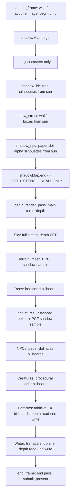

# Rendering — Timaert (Vulkan)

Source of truth for the **Vulkan render path**. Companion to
[vulkan.md](vulkan.md) (backend + GPU-assisted compute) and
[ARCHITECTURE.md](ARCHITECTURE.md) §Rendering & Compute Backend.

> **Status (2026-07-12).** The shipping game uses the Vulkan path for macro and
> subworld rendering. The subworld renderer has terrain, sky, water, structures,
> tree billboards, paper-doll NPC billboards, and one full-subworld directional
> shadow map. The 2D macro view is the macro fragment synth
> ([shaders/macro.frag](shaders/macro.frag)).

All backend objects live in `src/gpu/`; game logic never includes Vulkan
headers. Shaders are GLSL compiled to SPIR-V by `glslc` at build time (see
[vulkan.md](vulkan.md) §Shader toolchain).

---

## Frame structure

Each subworld frame is **two passes** recorded into one command buffer: a
depth-only **shadow pass** (scene from the sun's point of view) followed by the
**main pass** (scene from the camera). The split is why
[vk_renderer.h](src/gpu/vk_renderer.h) exposes `acquire_frame()` /
`begin_render_pass()` separately instead of only `begin_frame()`.



**Draw order and depth policy** (main pass):

| # | Pass | Pipeline | Depth test | Depth write | Blend |
|---|------|----------|-----------|-------------|-------|
| 1 | Sky | `create()` fullscreen | off | off | off |
| 2 | Terrain | `create_mesh()` | LESS | on | off |
| 3 | Trees | `create_mesh()` instanced | LESS | on | off (alpha-test discard) |
| 4 | Structures | `create_mesh()` instanced | LESS | on | off |
| 5 | NPCs | `create_mesh()` instanced | LESS | on | alpha |
| 6 | Creatures | `create_mesh()` instanced | LESS | on | alpha |
| 7 | **Particles** | `create_mesh(additive)` instanced | LESS | **off** | **additive** |
| 8 | Water | `create_mesh()` stride 0 | LESS | **off** | alpha |

Sky is drawn first as a backdrop; everything else depth-tests over it. Particles
and water are drawn last (after all opaque geometry) so they read existing depth
and blend without occluding it. Particles come **before** water so a torch/impact
glow does not double-count through a transparent surface it sits behind.

---

## Dynamic lighting

Lighting is driven entirely by a **time-of-day** scalar `tod ∈ [0,1)` and is
**extensible** — every pass takes the same sun/ambient inputs, so adding a light
consumer is a push-constant field, not an engine change.

- **Sun direction** — `sunAng = (tod − 0.25)·2π`; `sunDir = (cos, sin, 0)`.
  Shaded receivers use this as `L`, the direction **from the world toward the
  sun**, for `N·L`. Do not negate it when filling `MeshPush::sunDir`; negating it
  makes horizontal terrain receive no direct sun term, so ground shadows become
  invisible.
- **Sun colour** — warm orange near the horizon, neutral white overhead, scaled
  by a day-intensity `smoothstep` of the sun elevation (zero at night).
- **Ambient** — cool blue moonlight at night lerping to neutral grey by day, so
  night is **moonlit, never black**. Ambient is applied *unshadowed* (shadows
  only attenuate the sun term). The night floor is kept deliberately **low** so
  the directional moonlight (next) does the sculpting, not a flat ambient wash.
- **Moonlight (directional).** At night the moon is not merely ambient fill — it
  is a *weak directional light in its own right*, the anti-solar point
  `moonDir = -sunDir`. `compute_light_parameters`
  ([src/sub/lighting.h](src/sub/lighting.h)) folds it onto the **same**
  `sunDir`/`sunColor` slot the sun uses: as the sun sinks, a cool blue term
  (`{0.60, 0.70, 1.00}` × `kMoonDirGain`, currently `0.42`) fades up and the
  direction flips to `-sunDir`, so the one "sun" slot every shader already reads
  carries **whichever body is up**. The world stays *directionally sculpted* at
  night (relief, not a uniform grey), and because the light now arrives from the
  moon *above* rather than the sun *below the horizon*, it does **not**
  re-introduce the night-glow the contract below guards against. This one bearing
  is exactly what the visible moon disc ([sky.frag](shaders/sky.frag)) and the
  water specular ([water.frag](shaders/water.frag)) use — a **single celestial
  direction**, so the moon you see, the moonlight that lights the ground, and the
  reflection on the water all agree.
- **Point lights (positional).** On top of the one directional body, the world
  carries up to `kSubworldMaxLights` (32) **positional** lights — torches, the
  player's carried lantern, spell / projectile glows, lit windows. They live in
  a per-frame **storage buffer** at **set 0 / binding 1** (the same set every lit
  pipeline already binds for the shadow sampler), summed by `point_lights()` in
  [lighting.glsl](shaders/lighting.glsl) *additively* over `lit_surface()`:
  `col += base · Σ light.color · gain · atten · N·L`, with a smooth quadratic
  `atten = clamp(1 − d/radius, 0, 1)²`. The sum is **unshadowed** (the sun
  shadow map does not gate it) and returns exactly `vec3(0)` when the count is
  zero, so the whole feature is provably inert until an emitter exists.
  - *Three forms, one curve.* Surfaces with a real normal (terrain, structures)
    use `point_lights()` with the `N·L` term above. Camera-facing **billboards**
    (trees, NPCs, creatures) have no meaningful per-pixel normal, so they use
    `point_lights_flat()` — the **same** buffer, gain and `point_light_atten()`
    curve but **distance attenuation alone** (no `N·L`). Dropping `N·L` is
    deliberate: a chest-height torch gives `N·L ≈ 0` on an upright card and would
    leave an actor dark while lighting the ground at its feet — visually
    incoherent. This mirrors how `lit_surface()` already feeds billboards a flat
    `sunTerm` instead of a per-pixel one. Result: a tree, NPC or creature standing
    in a torch / spell / lantern pool warms with it exactly as its ground does.
    The **water** surface ([water.frag](shaders/water.frag)) is neither diffuse
    ground nor a flat sprite — it is a mirror, so it uses the third form
    `point_lights_spec()`: a **half-vector glint** (`pow(N·H, ·)`, a tight core
    plus a soft wider halo) that reflects the light *source* off the wave normal,
    the point-light analogue of the sun/moon "лунная дорожка" the same shader
    already draws for the directional body. A lantern on the shore paints a
    shimmering coloured streak that rides the ripples. It is added **after** the
    day/night ambient wash (a torch reflection is its own light, not scaled by the
    sun's time of day), so it reads at night and washes out under a bright day
    surface. All three forms share `point_light_atten(dist, radius)` so a pool
    reaches the same distance whether it lands on the floor, on a body standing in
    it, or as a glint on the water beside it.
  - *One universal source.* Any subworld entity may carry a `LightEmitter`
    ([src/ecs/components.h](src/ecs/components.h)); the renderer's
    `gather_point_lights()` packs **every** `view<Position, LightEmitter,
    SubworldTag>` entity into the buffer each frame with no per-emitter code —
    the player lantern, an NPC torch and a fireball glow all take the identical
    path. Positions are built in the same window/composite space as terrain
    `vWorld` (`tile_to_world` for XZ, `sample_height_m` for ground Y) plus the
    emitter's metres offset, so a light lines up with the surface it lights.
  - *Nearest-N cull.* The gather has **no upper bound while collecting** — a
    dense settlement full of torches or lit windows can nominate far more than
    the SSBO's `kSubworldMaxLights` (32). `cull_nearest_lights()`
    ([src/sub/lighting.h](src/sub/lighting.h)) then keeps the 32 **closest to the
    camera** (`std::nth_element` on squared distance, O(n)); at or under budget it
    is a **no-op** and the buffer is byte-identical to the pre-cull renderer, so
    every scene today is unaffected. The player's own light rides the camera at
    ≈0 distance, so it is always in the near set and never dropped for a distant
    torch. The shader sum is order-independent, so partitioning the survivors
    changes nothing visible. The cull is a pure, Vulkan-free helper unit-tested
    in `point_light_cull_test` (the overflow path is not otherwise reachable
    in-game yet).
  - *No-stall upload.* The buffer is a **persistently-mapped host-visible ring**
    (one per frame in flight, `create_host_mapped`). It is written straight
    through the mapping in `record_main` *after* `acquire_frame` reset the
    frame's fence — the slot is GPU-idle, so there is no staging copy, no barrier
    and no queue stall (the no-stall transfer contract).
  - *First emitter — the player lantern.* The player entity carries a warm
    `LightEmitter` (radius 16 m, intensity 1.35, RGB `{1.00, 0.72, 0.42}`, seated
    1.2 m up). Because it is additive over the directional term it reads as a
    warm pool at night and is washed out by daylight on its own — verified by eye
    at 01:00 (clear warm ground pool against the cool moonlit distance) and 08:00
    (indistinguishable from no lantern). Possession moves only `PlayerTag`, so
    lighting simply follows whatever body is possessed with no special case.
  - *Second emitter — travelling spell bolts.* Every spell projectile from the
    shared `emplace_projectile()`
    ([src/content/spells/registry.cpp](src/content/spells/registry.cpp) —
    fireball, ice shard, magic bolt, lightning chain) carries a `LightEmitter`
    built by `bolt_light()` from data the spell already passes: the light colour
    is the bolt's **sprite element tint** normalised so the brightest channel is
    1 (a pale ice tint still reads bright), and the reach/intensity scale from
    the projectile radius (a fat fireball throws a wider, brighter pool than a
    thin bolt). One formula, no per-spell code — a new spell lights in its own
    colour for free. Because the light rides the bolt's `Position`, which the
    projectile sim advances every tick, the pool **travels with the bolt** and
    sweeps the ground as it flies. Note this is also the bolt's *only* visual
    presence in the 3D subworld: the sprite pass skips `archetype == 0xFF`
    (projectiles), so the glow is what you see. Verified at 01:00 (settlement
    walls bathed in warm fireball light; `cast_bolt_capture` reports `lit=1`
    and, after a short pre-capture flight, `alive=1`).
  - *Third emitter — data-driven NPC torches.* A humanoid NPC type can carry a
    torch purely by **data**: `NpcTypeDef`
    ([src/macro/npc.h](src/macro/npc.h)) has six opt-in light fields
    (`lightRadius`, `lightIntensity`, `lightR/G/B`, `lightHeight`), all
    defaulting to `0` — a row that sets none is dark, so the feature is strictly
    opt-in and a torch is tuned by editing one table row, never code. Today only
    the **Guard** row lights (radius 11 m, intensity 1.15, RGB
    `{1.00, 0.66, 0.34}`, seated 1.1 m up — a warmer, tighter pool than the
    player lantern so a patrolling guard reads as *carrying* a torch rather than
    being a second sun). A single file-local `maybe_emplace_carried_light` helper
    copies those fields verbatim into an `ecs::LightEmitter` at **every** humanoid
    spawn site — settlement population, the player squad and macro→subworld
    projection ([src/sub/spawn.cpp](src/sub/spawn.cpp)) plus the console /
    encounter path `spawn_hostile_npc` ([src/sub/engine.cpp](src/sub/engine.cpp))
    — so a guard is lit identically however it enters the world, and from there
    it rides the exact same universal `gather_point_lights()` path as the lantern
    and the bolts with zero renderer code. The helper is deliberately duplicated
    per-TU (mirroring `maybe_emplace_missile_attack`), not shared. The spawn-layer
    wiring — opt-in data contract, verbatim copy, `+Y` seating, and *only* the
    lit types getting an emitter — is pinned by `carried_light_spawn_test`
    (pure ECS + data, through the shipping City spawn path). Verified on-screen at
    01:00 with an A/B that isolates the torch: a seed-locked `guard` probe vs a
    `peasant` probe at identical staging, with every non-probe light stripped
    (`TIMAERT_SMOKE_SOLO_PROBE_LIGHT`) so the guard's own torch is the *only*
    emitter in frame — the guard frame shows a warm radial ground pool (pool
    region RGB ≈ `{30,19,12}`, warm R>G>B) where the peasant frame is flat night
    ground (≈ `{6,6,6}`, neutral), a ~5× localized lift that appears iff the
    guard carries its `LightEmitter`.

The shaded surface colour — **defined once** for every lit object in
[shaders/lighting.glsl](shaders/lighting.glsl) as `lit_surface()`:

```
col = base · (ambient.rgb + sunColor.rgb · sunTerm · shadowFactor)
```

Every lit fragment stage — terrain ([mesh.frag](shaders/mesh.frag)), structures
([struct.frag](shaders/struct.frag)), and the tree / NPC / creature billboards
([billboard](shaders/billboard.frag), [npc](shaders/npc.frag),
[creature](shaders/creature.frag)) — does `#include "lighting.glsl"` and calls
`lit_surface()`, so the day/night response lives in **one place** and cannot
drift or be re-implemented (subtly wrong) per shader. Only the `sunTerm`
differs: terrain and structures quantise `N·L` to 4 bands for a pixel-retro
look; billboards pass a flat constant (`0.7` trees/creatures, `0.75` NPCs) since
they have no meaningful per-pixel normal.

**Night-glow contract (universal day/night switch).** Because `sunColor` carries
the day-intensity — the **sun's** contribution scaled to zero as it drops below
the horizon in `compute_light_parameters`
([src/sub/lighting.h](src/sub/lighting.h)) — the direct term
`sunColor · sunTerm · shadow` falls away together for *every* object as the sun
sets, with no per-object drift. At night that same slot is **repurposed to carry
the moon** (the weak cool term from `-sunDir`, above), so the world is still lit
directionally, just from overhead instead of from a sun below the horizon. This
is deliberately the single switch. An earlier build left the intensity out of
`sunColor` and open-coded the combine in each shader, so billboards (flat sun
term) and vertical wall faces (`N·L` still catches the below-horizon sun's large
horizontal component) "glowed" at night, while flat terrain escaped only by
geometry (upward `N·L ≤ 0` against a sun that is down). Fold intensity in at the
source + combine in one place and all object classes track day/night together —
and the moon, riding the same slot, inherits that safety for free (its light
comes from *above*, so it lights without glowing). Do **not** re-scale `sunColor`
in a shader or add a per-shader ambient floor — either re-introduces the glow.

The subworld game maps `tod` from `WorldTime`; see
[src/sub/lighting.h](src/sub/lighting.h) `compute_sun()` for the production
sun/colour curves this harness mirrors.

---

## Macro night lighting (2D map)

The flat top-down macro view ([shaders/macro.frag](shaders/macro.frag)) has its
own night-glow system, separate from the subworld sun/shadow path above. A
per-cell **light field** is baked on the CPU whenever the world changes and
sampled once in the macro synth's `nightDarken` stage:

- **Emitters** are enumerated data-drivenly from world state
  (`collect_macro_lights`): settlements/villages glow population-scaled, active
  spires at a fixed strength, off each type's `LandmarkDef.lightColor`.
- **Spread** is terrain-occluded — a bounded Dijkstra over the feature grid's
  per-feature optical cost (roads carry light furthest, forest canopy smothers
  it), so light flows over open ground and *around* dense stands. With no feature
  layer it falls back to an exact Euclidean radial.
- **Brightness** has one director knob, `kMacroGlowGain` (`macro_lighting.h`),
  applied in the bake before the `kMacroGlowCeil` clamp/encode.
- **Upload** is surgical: `vk_macro_renderer::upload_light_field` rewrites only
  descriptor **set 0 / binding 4**, leaving the master/feature/zone/river synth
  inputs live.
- **Re-baked** on world-gen, save-load, and daily population drift only — never
  per frame.

The shader decodes (`· kMacroGlowCeil`) and adds the glow scaled by the same
`nightDarken` day/night curve that darkens the base map. Full pipeline, cost
table, rebake triggers and the mountains→biome occlusion caveat:
**[macro-lighting.md](macro-lighting.md)**.

---

## Shadow mapping

This is the answer to the standing requirement: **no floating shadow blobs — cast
shadows must land on the terrain and on other objects.** We render a real
depth-map from the sun and sample it with PCF.

### Shadow resource — [vk_shadow.h](src/gpu/vk_shadow.h)

`gpu::VulkanShadowMap` owns one square depth target:

| Property | Value |
|----------|-------|
| Size | 4096×4096 |
| Format | `VK_FORMAT_D32_SFLOAT` |
| Usage | `DEPTH_STENCIL_ATTACHMENT` + `SAMPLED` |
| Sampler | `NEAREST`, clamp-to-edge |
| Render pass | depth-only, `CLEAR → STORE`, final layout `DEPTH_STENCIL_READ_ONLY_OPTIMAL` |
| Sync | two subpass dependencies (fragment-read ↔ depth-write) |

`begin(cmd)` opens the depth pass (clear depth = 1, viewport/scissor = size),
`end(cmd)` closes it and transitions the image to read-only so the main pass can
sample it.

### Light matrix

The sun is directional, so the shadow camera is an **orthographic** box in light
space. The production subworld uses one full-3×3-subworld shadow map instead of a
camera-centred bubble:

```
toSun    = normalize(sunDir)                  // world -> sun
fromSun  = -toSun                              // sun -> world
center   = (0, kHeightScale·0.45, 0)
lightEye = center - fromSun · 4200
lightMvp = vk_ortho(-2300..2300, -2300..2300, 0.5..9000) · lookAt(lightEye, center, lightUp)
```

`vk_ortho`/`vk_perspective` are the subworld-local **Vulkan-depth (0..1)** helpers
([src/sub/vk_camera_math.h](src/sub/vk_camera_math.h)); `core/math.h` projection
matrices are GL-style (depth −1..1) and must not be used directly for Vulkan clip
space.

### Depth-only pipeline — `create_shadow()` in [vk_pipeline.h](src/gpu/vk_pipeline.h)

- Colour blend `attachmentCount = 0` (no colour target).
- Depth test + write, compare `LESS`.
- Raster depth bias is **disabled**. Bias is applied in receiver shaders in the
  same normalized light-depth space as the shadow lookup; large raster bias on a
  full-subworld frustum erases small casters (NPCs/trees) via peter-panning.
- Push constants `VERTEX | FRAGMENT`.
- Optional descriptor set layout is supported for alpha-tested casters such as
  paper-doll NPCs.

### Casters

| Caster | Vertex | Fragment |
|--------|--------|----------|
| Trees | [shadow_bb.vert](shaders/shadow_bb.vert) — expand instance quad along sun-derived `lightRight` | [shadow_bb.frag](shaders/shadow_bb.frag) — shared `treeCoverage()` `discard` (real silhouette) |
| NPCs | [shadow_npc.vert](shaders/shadow_npc.vert) — expand instance quad along sun-derived `lightRight` | [shadow_npc.frag](shaders/shadow_npc.frag) — samples paper-doll `sampler2DArray` alpha and discards transparent pixels |
| Structures | [shadow_struct.vert](shaders/shadow_struct.vert) — expand the per-instance box (cube from `gl_VertexIndex`) by `lightMvp` | [shadow_struct.frag](shaders/shadow_struct.frag) — empty (depth only) |

**Universal billboard shadows (no bespoke silhouettes).** A billboard's shadow is
cast from its *own* visible coverage, not a hand-authored blob. Procedural trees
share `treeCoverage()` between lit and depth-only passes. Paper-doll NPCs use the
same composited 48×48 texture-array layer for lit rendering and shadow alpha, so
macro and micro NPCs come from the same character atlas and cast the current frame
silhouette. The same pattern should be reused for future sprite classes: lit pass
samples/draws coverage, shadow pass samples the same coverage and only writes
depth for opaque pixels.

### Receivers (PCF sampling)

Terrain and structures bind the shadow map at **set 0, binding 0** and sample it
with a 3×3 PCF kernel. A fragment is lit when its light-space depth (minus bias)
is nearer than the stored depth:

- **Terrain** ([mesh.frag](shaders/mesh.frag)) samples **per-fragment** at
  `lightMvp · vWorld` with normalized receiver bias
  `max(0.00008, 0.00035·(1−NdotL))`.
- **Structures** ([struct.frag](shaders/struct.frag)) sample **per-fragment** at
  `lightMvp · vWorld` with the same slope-scaled receiver bias as terrain.
- **Billboards** currently **cast but do not receive** shadow-map lighting. A flat
  billboard receiver sampled at one base point made whole sprites pop to black
  near other billboards. Future per-pixel billboard normals or sprite-depth cards
  can add receiving back without changing the shadow-map resource.

Result: terrain and structures receive PCF shadows; trees, structures, and NPCs
cast into the shared depth map. Terrain is intentionally not rendered as a caster
in this single full-subworld shadow map: self-shadowing the coarse receiver mesh
creates tile-scale zebra bands instead of useful object shadows. Shadows swing
through the day/night cycle because `lightMvp` tracks `sunDir` every frame.

### Extending shadows

- **New caster** — add a `create_shadow()` pipeline for the mesh and draw it
  inside `shadowMap.begin()/end()`. Give it the same `lightMvp`.
- **New receiver** — bind the shadow set (set 0, binding 0), push `lightMvp`,
  copy the `shadowFactor`/`treeShadow` helper, multiply the sun term by it.
- **Softer shadows / cascades** — widen the PCF kernel, or add a second
  `VulkanShadowMap` at a tighter ortho box and select by view distance. No API
  change beyond another descriptor binding.

---

## Sky and stars

[shaders/sky.frag](shaders/sky.frag) renders a **texture-free** procedural
celestial dome from a camera-basis push (`forward/right/up`, resolution, fov,
`tod`, fog colour, time). One fullscreen triangle
([fullscreen.vert](shaders/fullscreen.vert)), depth off, drawn first.

Layers: day/night/twilight gradient, sun disc + glow + horizon scatter, a
**prominent two-lobe moon** (near-white disc + tight core bloom + wide cool halo,
sized to read as the night's light source) fixed at the anti-solar point
`-sunDir` so it sits over the exact bearing the terrain is lit from and the water
road points back toward, **three equirectangular star densities** + a Milky-Way
band (`dot(rd, mwN)`) + per-star twinkle and colour temperature, and FBM clouds.
This is intentionally richer than the old baked star texture.

---

## Terrain and trees

- **Terrain** — a heightmap quad mesh (shipping: 192×192 quads, harness:
  128×128) with central-difference normals, indexed triangles, lit + shadowed as
  above. Vertex = `{vec3 pos, vec3 normal, vec2 uv}`, where `uv` is the
  normalised grid position (`0..1`). Ground colour is a **procedural per-biome
  synth** ([shaders/mesh.frag](shaders/mesh.frag) `groundColor`/`materialBase`),
  but the **material id that drives it is sampled per-fragment, not interpolated
  from the mesh vertices**. The renderer bakes a full-resolution R8 tile-material
  texture (`u_material`, descriptor **set 1**) in `upload()` — one texel per
  world tile, independent of the terrain tessellation — and the fragment stage
  looks it up at `vUv`.

  This is the fix for roads / field bands / shorelines rendering as
  **disconnected blobs (пятна)** instead of connected lines. The mesh is coarse
  — ~16 world tiles between vertices at 192² (more at the harness's 128²) — so a
  1-tile-wide road carried as a *per-vertex* material attribute simply falls
  between vertices and dissolves. Sampling the id *per-fragment* from the
  full-res grid keeps thin features crisp and continuous, exactly like the TS
  authority's per-fragment `u_tileGrid` lookup (`v_uv = a_pos` in renderer-3d).
  The synth then layers the quantised pixel-art per-material variation on top (no
  atlas, same philosophy as the macro synth). In the shipping game the ids come
  from the seamless tile grid ([src/sub/renderer_3d.h](src/sub/renderer_3d.h)),
  resolved once per biome cell while baking; the harness fakes a small grid
  (biome-by-height + a cross road) so the standalone smoke drives the identical
  path. The set-1 material descriptor is allocated once and rewritten on each
  `upload()` (load-time / seam-cross only — never per frame) — and, on a seam
  crossing, re-pointed to the ping-pong sibling image after an on-GPU relocation
  (see §Seam crossing below and [seamless-crossing.md](seamless-crossing.md)).

  *Next polish:* the per-material **surface** variation still reads
  "fabric-like" (a woven micro-pattern) rather than natural ground. The material
  routing above is correct and shipped; it is the texture synth inside
  `groundColor` that still needs a pass.
- **Trees** — **instanced procedural billboards**. One `vkCmdDraw(6, treeCount)`
  draws the whole forest: the quad corners come from `gl_VertexIndex`, and a
  per-instance buffer supplies `{vec3 pos, size, species, seed}`. The fragment
  stage draws 7 species (pine/birch/willow/jungle/oak/cherry/autumn) **per pixel**
  keyed by species+seed — no atlas, no per-tree CPU cost, full variety. Camera
  facing is cylindrical (world-up stays vertical, right follows the camera).
  The macro-map tree decor in [macro.frag](shaders/macro.frag) intentionally keeps
  the old irregular single-cell blob as the visual base, then uses the project's
  3×3 context rule only to add small neighbouring crown caps across shared
  forest edges/corners. That preserves crisp organic tree shapes, avoids square
  forest fills or one-direction smears, and lets neighbouring biomes/temperatures
  mix their tree colours naturally on forest borders.
- **NPCs** — **instanced paper-doll billboards**. The micro-world uses the same
  composited character atlas frames as the macro overlay via
  `character::PaperdollAtlas` + `gpu::SpriteArray` (48×48 `sampler2DArray`).
  `prepare_frame()` resolves the current `AnimationState` (`Idle`/`Walk` plus
  direction from `SubworldAi::vx/vy`), uploads any newly composed layers before
  the render pass, and fills the NPC instance buffer with `{pos, size, layer}`.
  The lit pass samples [shaders/npc.frag](shaders/npc.frag); the shadow pass
  samples the same layer alpha in [shaders/shadow_npc.frag](shaders/shadow_npc.frag).

## Water

[shaders/water.vert](shaders/water.vert) builds a flat quad at `waterLevel`
straight from `gl_VertexIndex` (no vertex buffer — the pipeline is created with
`vertexStride = 0`). [shaders/water.frag](shaders/water.frag) animates a wave
normal from two drifting noise fields, then adds a Fresnel sky reflection, a
**sun/moon specular highlight**, **positional-light glints** (see below), and a
depth tint; output alpha `0.82`. Depth-test on, depth-write off, alpha blend — so
it fills valleys below the water line while hills poke through. The water pipeline
binds **set 0** (the shared shadow-sampler + point-light SSBO layout) so the
fragment shader can reflect the same positional lights every other lit pass sees.

The specular is a **half-vector two-lobe** model sharing the one
`sunDir`/`sunColor` slot, so it serves the sun by day and the moon by night with
no branch: a tight core glint (`pow(N·H, 80)`) is the compact daytime highlight,
and a far wider lobe whose spread is gated by `1 − |L.y|` opens **only when the
light sits low** over the horizon — smearing the reflection into the long
shimmering "glitter road" (the *лунная дорожка*) that points back at the viewer
for a setting sun or a risen moon, while an overhead midday sun keeps a compact
spot (the daytime look is unchanged). The road stages at real shorelines; a
landlocked or massif-occluded spawn (e.g. seed `12345`) may show no open water
along the celestial bearing — use `TIMAERT_SMOKE_WATERSCAN` (see §Frame capture)
to find a coast.

**Positional lights reflect on the water too.** `point_lights_spec()`
([lighting.glsl](shaders/lighting.glsl), the third of the three point-light forms
in §Dynamic lighting) adds a half-vector glint for every active point light —
same buffer, same `point_light_atten()` radius curve as the ground and billboard
forms. A torch, the player's lantern or a spell bolt drifting near the shore
throws a small coloured reflection that shimmers across the ripples, added on top
of the day/night wash so it reads at night exactly as the light pools on the
ground beside it. Inert when no emitter exists (the buffer count is zero). Stage
it headless with `GPU_SMOKE_LIGHT_WATER=1` (see §Frame capture), which finds the
scene's deepest water cell and aims the camera across it.

---

## Particles / additive FX

Transient visual effects — spell trails, impact bursts, blood, dust, embers,
explosions — render as **additive billboards** in a pass drawn after all opaque
geometry and creatures, immediately before water. The pass is **emissive**: it
binds **no descriptor set** (no lighting, no shadow — the particles *are* the
light), keeps depth-**test** on so terrain/trees/creatures occlude them, and
depth-**write off** + **additive blend** (`dstColorBlendFactor = ONE`) so
overlapping cards accumulate into a glow with **no back-to-front sort**. Additive
blend is order-independent by construction, which is the whole reason the pool
needs no per-frame depth sort. At the 8-bit LDR swapchain, dense overlap
saturates to white — exactly the white-hot-core-to-warm-halo look of pixel-art /
Final-Fantasy magic FX.

**The pipeline flag.** `create_mesh(..., additive)` (the trailing bool on both
overloads, [vk_pipeline.h](src/gpu/vk_pipeline.h)) is the *only* renderer-side
switch: `additive=true` flips the colour-blend `dst` factor from
`ONE_MINUS_SRC_ALPHA` to `ONE`. Every other pass passes the default `false` and
is byte-for-byte unchanged. The particle pipeline is the sole caller today.

**The sim is Vulkan-free and lives on the engine, not the renderer.** Transient
VFX are deliberately **not** ECS entities — they are a flat POD pool
(`Particle pool_[2048]`) advanced by a pure CPU integrator in
[src/sub/particles.h](src/sub/particles.h) / `.cpp`. This keeps the sim
**standalone-unit-testable** (`particle_sim_test` asserts table ranges, emit
counts, lifecycle reaping, physics sign, pack envelope, and seed determinism with
zero GPU) — the project's correctness brake. The engine owns a `ParticleSystem`,
ticks it in `SubworldEngine::tick(dt)` (pure integrate + reap, no ECS churn), and
in `prepare_frame` packs the live pool into a reused scratch buffer and hands it
to `Renderer3DVk::stage_particles()`. Emitters stay **universal ECS components**;
the combat / spell ticks feed the pool, so there is no per-effect hardcoding at
the call sites.

**One table, no hardcoding.** A `FxKind` enum + a `constexpr kFxPresets[]` table
(mirrors the monster/loot/`NpcTypeDef` "one table" rule) is the single source of
truth for every effect's count, speed, gravity, lifetime, size envelope, drag,
colour and spread. Adding an effect is one table row, not code at the spawn site.

**Upload path** mirrors the NPC dynamic-instance pattern exactly:
`stage_particles()` clamps the count to `kMaxParticleInstances` (2048), then a
per-frame `vkCmdUpdateBuffer` + `TRANSFER_WRITE → VERTEX_ATTRIBUTE_READ` barrier
into the device-local instance buffer. The 2048 ceiling is not arbitrary: at 32 B
per `ParticleInstance` it is exactly the 64 KiB `vkCmdUpdateBuffer` per-call
maximum. A `static_assert` pins `sizeof(ParticleInstance) == 32` and
`kMaxParticleInstances == ParticleSystem::kMaxParticles` so the vertex-attribute
layout and the pool size can never silently desync.

**The billboard.** [shaders/particle.vert](shaders/particle.vert) is a *centred,
fully camera-facing* quad — it needs **both** camera axes (`camRight` **and**
`camUp` in `ParticlePush`), unlike the cylindrical tree billboards that pivot on
world-up, because a spark has no up. Three instanced attributes: `vec3 pos`,
`float size`, `vec4 colour` (rgb + envelope alpha).
[shaders/particle.frag](shaders/particle.frag) is a soft radial spark: a
squared `1 − r` falloff from the quad centre, alpha-premultiplied, whitening the
core (`mix(colour, white, fall·0.35)`) so dense cores read as white-hot; it
`discard`s once alpha drops below a threshold.

**The pass self-skips when the pool is empty** (`particleCount_ == 0`, the common
case) → zero cost when nothing is emitting. This is why every non-FX scene today
is unchanged.

Verify it headless with `GPU_SMOKE_FX=1` (see §Frame capture): it stages a
standing additive burst over the cluster centre. Paired with `GPU_SMOKE_NIGHT=1`
it produces an unmistakable warm bloom against the dark forest; the A/B proof
(FX on vs off, same camera) shows **only** brightening — zero pixels darken,
because additive can only add — with the core saturating from near-black night
ground to `(255,255,254)`. Midday shows **no blowout** (0 % near-white pixels).

### Inc B — spell-bolt trails + impact bursts

The first gameplay emitter. Every flying spell bolt now sheds a **glowing wake**
as it travels and blooms an **impact burst** where it detonates — both tinted by
the bolt's *own* colour, with **zero per-spell branching**.

**Routing keeps `spell_effects.cpp` renderer-free.** The spell tick already used
C-style `void* user` callbacks (`SpellDamageLogFn`, `SpellCanHitFn`) so the pure
combat TU never sees engine/renderer types. Inc B adds one more in the same shape:
`SpellFxEmitFn(user, event, entity, ax,ay, bx,by, blastRadius)`. The tick fires it
at two points — a `Trail` event after each bolt-advance (with the tile-space
segment `prev→pos` the bolt just crossed) and an `Impact` event at a hit or an
explode-on-expiry (`ax,ay == bx,by`, the detonation point). `entity` is always the
bolt, still valid at both call sites (fired *before* it is reaped), so the engine
can read its `Sprite` for the colour. `spell_effects.cpp` stays free of every
particle / renderer symbol; the engine's static `spell_fx_emit_callback` is the
only place the two worlds meet.

**Colour comes from the bolt, not a lookup.** The callback reads the bolt's
`Sprite{r,g,b}` (u8) and normalises it so the **peak channel → 1.0**, hue
preserved — the *same* formula `bolt_light()` uses for the bolt's point-light
(registry.cpp), so wake, dynamic light and burst all share one hue. No `Sprite`
(e.g. a bare meteor) ⇒ fall back to the `FxKind` preset colour. A fireball trails
warm orange, a frost bolt icy blue, an arcane charge violet — all from data the
bolt already carries.

**Archetype comes from one physical field.** The impact picks its preset from the
bolt's `blastRadius`: `> 0` ⇒ an explosive `FireBurst` bloom whose scale grows
(gently, capped `1..3×`) with the blast; `== 0` ⇒ a crisp `MagicBurst` point-pop.
That is the *same* field the blast-damage path keys off, so the visual can never
disagree with the mechanics — a fat AoE fireball erupts big, a single-target charge
pops small, with no per-spell table.

**The trail is stateless and framerate-independent.** A transient bolt lives only
for the tick, so it carries no caller-owned accumulator. `emit_streak(kind, a, b,
spacingM, tint)` lays one mote every `spacingM` metres *of travel* (here 1.5 m),
interpolating along `a→b` — density is per-metre, not per-frame, so a 280 u/s and a
400 u/s bolt read as the *same* continuous wake. It caps at 64 motes per call
(a huge single-tick jump can't flood the pool) and degenerates to a single head
mote when the segment is shorter than the spacing. The endpoints are converted
tile→world and seated at the bolt's flight height (`sample_height_m + 1 m`, matching
the point-light offset) so the wake rides exactly where the bolt is.

Verify it headless with `GPU_SMOKE_FX_TRAIL=1` (optionally `GPU_SMOKE_FX_VIOLET=1`
to recolour). The harness doesn't link `particles.cpp`; it hand-stages an
Inc-B-shaped layout (a fading 16-mote line into a 4-ring head burst) through the
byte-identical shipping particle pass, so the A/B isolates exactly the additive
draw. Night A/B (trail on vs off, same camera): **zero** pixels darken (additive
can only add), and the mean *added* RGB is warm for fire (`R>G>B`) vs violet for
arcane (`B>R`) — the tints are measurably, and visibly, distinct.

---

## Structures (walls & houses)

City walls and houses render as **instanced boxes** — the same
geometry-from-`gl_VertexIndex` trick as the trees/water, so one
`vkCmdDraw(36, structCount)` draws the whole settlement with **no geometry vertex
buffer**. The per-instance buffer supplies `{vec3 centre, vec3 halfExtent, type,
seed}`; [struct.vert](shaders/struct.vert) builds a unit cube with outward face
normals and scales/translates it per instance. [struct.frag](shaders/struct.frag)
keys colour off `type` (stone wall vs. tan house body + red-brown roof band) and
lights it with the shared sun + ambient + PCF shadow. Walls and houses both cast
([shadow_struct.vert](shaders/shadow_struct.vert)) and receive shadows.

**Extensible by design:** a new structure kind (tower, gate, ruin, bridge) is one
more `type` value + one branch in the fragment stage — no new pipeline, no new
geometry. The shipping game feeds the real `Structure[]` records
([src/sub/map_data.h](src/sub/map_data.h)) — which already exist for walls,
houses and bridges — in place of the harness settlement, and can swap the box for
a pitched-roof or arbitrary mesh without touching the pass wiring.

---

## Seam crossing (incremental terrain upload)

`Renderer3DVk::upload()` rebuilds the terrain mesh + material image from the
seamless manager. It runs **load-time / on seam-cross only, never per frame**,
and is *scoped* by a `CompositeDirty` struct so a boundary crossing costs
**O(new content)** instead of a full 3072² rebuild. Full design +
verification + gotchas are in **[seamless-crossing.md](seamless-crossing.md)**;
the renderer-side mechanics in brief:

- **Three modes**, chosen from `CompositeDirty`: **full** (first upload, height
  smooth, or the two-crossing fallback), **shift** (a re-centre), **per-cell** (an
  async worker drain stitched one 1024-tile cell at a time).
- **Height (shift)** — the persistent `Nv×Nv` vertex grid `heightVtxM_` is slid
  in place by `std::memmove` (toroidal, in vertices), then only the clamped 1-vertex
  border ring + the fresh cells are resampled. The vertex buffer is rebuilt whole
  from the grid (trivial) so all normals stay correct.
- **Material (shift)** — a **GPU ping-pong**: two R8 images
  (`materialTex_ ↔ materialTexAlt_`). One `vkCmdCopyImage` relocates the unchanged
  6/9 (axis) or 4/9 (diagonal) overlap on the GPU, `vkCmdCopyBufferToImage` fills
  only the fresh cells, then the two images `std::swap` and the set-1 descriptor is
  rewritten to the new front (`gpu::blit_shift_r8`,
  [vk_texture.cpp](src/gpu/vk_texture.cpp)). Valid because
  `material_new[cell] == material_old[shifted-from cell]` over the overlap.
- **Fence contract** — `upload()` runs at the same fenced point as the in-place
  image updates, so the swap + `vkUpdateDescriptorSets` are safe with no in-flight
  frame sampling the image; validation reports zero new barrier/layout errors.

Result: the crossing frame's `upload3d` dropped from **11.2 ms → 6.5 ms** — one
frame, well under the 16.6 ms / 60 fps budget — with GPU-readback and
FP-tolerance self-checks proving the incremental result byte/precision-identical
to a full rebuild.

---

## Push-constant layouts

All matrices + lighting travel as push constants (`VERTEX | FRAGMENT`).

| Pass | Struct | Bytes | Contents |
|------|--------|-------|----------|
| Macro synth | `Push` (macro.frag) | 32 | resolution, mapSize, viewCells, seaLevel, seed, time |
| Sky | `SkyPush` | 80 | forward, right, up, (resX,resY,fov,tod), (fogRGB,time) |
| Terrain | `MeshPush` | 176 | mvp, sunDir, sunColor, ambient, lightMvp |
| Trees | `BbPush` | 176 | mvp, camRight, sunColor, ambient, lightMvp |
| Structures | `MeshPush` (reused) | 176 | mvp, sunDir, sunColor, ambient, lightMvp |
| Water | `WaterPush` | 128 | mvp, camPos, sunDir, sunColor, (time,ambient,waterLevel,extent) |
| Shadow (mesh) | `ShadowPush` | 64 | lightMvp |
| Shadow (trees) | `ShadowBbPush` | 80 | lightMvp, lightRight |
| Shadow (struct) | `ShadowPush` (reused) | 64 | lightMvp |
| Shadow (NPC) | `ShadowBbPush` | 80 | lightMvp, lightRight |

> **Portability.** MoltenVK allows 4096-byte pushes, so 176 B is fine on macOS.
> **AMD desktop caps `maxPushConstantsSize` at 128**, so before broad Windows/GPU
> support the per-frame matrices (mvp / lightMvp) should move into a per-frame UBO,
> keeping only small per-draw data in push constants.

---

## Pipeline factory — [vk_pipeline.h](src/gpu/vk_pipeline.h)

One `gpu::VulkanPipeline` type, three constructors:

| Method | Use | Notes |
|--------|-----|-------|
| `create()` | Fullscreen fragment passes (macro synth, sky) | No vertex input; depth-stencil state present but disabled (valid against the depth render pass); optional descriptor-set layout |
| `create_mesh()` | Terrain, trees, structures, NPCs, water | Vertex input binding (rate VERTEX or INSTANCE); depth test/write, optional blend, optional back-face cull, one or more descriptor-set layouts. **`vertexStride == 0` ⇒ no vertex input** (geometry from `gl_VertexIndex`, used by water) |
| `create_shadow()` | Depth-only casters | No colour attachment; optional descriptor-set layout for alpha-tested sprite casters; used inside the shadow pass |

Adding a pass = pick the right constructor, add the SPIR-V pair to the `glslc`
`foreach` in [CMakeLists.txt](CMakeLists.txt), record the draw in the correct
phase. No new pipeline abstraction needed.

---

## Frame capture (visual self-check)

The renderer can dump a rendered frame to a PNG so an agent (or a human) can
**look at the actual image** instead of trusting that a smoke "passed". It is
test/tooling only and degrades to a clean no-op where unsupported.

- **Swapchain** — [vk_swapchain.cpp](src/gpu/vk_swapchain.cpp) adds
  `VK_IMAGE_USAGE_TRANSFER_SRC_BIT` to the presentable images when the surface
  supports it and records that in `VulkanSwapchain::transferSrc`; capture is a
  no-op when absent.
- **Renderer** — [vk_renderer.h](src/gpu/vk_renderer.h): arm with
  `request_capture()` **before** `end_frame()`; `end_frame()` copies the presented
  image into a persistent host-visible buffer inside the same command buffer;
  drain with `take_capture(px, w, h, fmt)` **after** `end_frame()`. Pixels come
  back in the swapchain's native format (BGRA on MoltenVK).
- **App smoke** — [main.cpp](src/app/main.cpp) `write_smoke_frame_png()` swizzles
  BGRA→RGBA, forces opaque alpha, and writes via `stb_image_write`. Triggered from
  a smoke script by the **`capture_frame`** action token.

Environment knobs (all opt-in; the smoke composes them, so one run can pose the
camera, set the hour, and dump a frame):

| Env var | Effect |
| --- | --- |
| `TIMAERT_SMOKE_SCRIPT` | comma-separated action tokens; include `capture_frame` to dump |
| `TIMAERT_SHOT_PATH` | output PNG path (else `/tmp/timaert_shot_<NN>_<label>.png`) |
| `TIMAERT_SMOKE_SEED` | world seed |
| `TIMAERT_SMOKE_HOUR` | force the game clock to `0..23` (picks day vs night lighting) |
| `TIMAERT_SMOKE_YAW` / `_PITCH` | camera aim in degrees (yaw `0` = `+X`) |
| `TIMAERT_SMOKE_SUBPOS` | teleport the player to `"x,y"` in the subworld |
| `TIMAERT_SMOKE_WATERSCAN` | report the longest east–west open-water run (find a coast to stage the moon road) |
| `cast_bolt_capture` (action) | cast a spell, assert the bolt spawned with a `LightEmitter`, optionally fly it clear, then arm capture in the same step |
| `TIMAERT_SMOKE_SPELL` | which spell `cast_bolt_capture` casts; default `fireball` |
| `TIMAERT_SMOKE_BOLT_FLIGHT` | seconds to fly the bolt clear of the caster before the shot (clamped `0..0.30`) |
| `light_probe_capture` (action) | spawn one actor (a procedural creature *or* a drawn-art humanoid like `guard`), relocate it a fixed distance straight ahead, aim the camera down at it, **hold it pinned for a few settle frames, then** arm capture — a deterministic actor-in-point-light frame. The settle hold is load-bearing: staging runs in `tick_smoke_script`, which fires *after* the frame's 3D scene is already recorded, so a same-tick capture would photograph the pre-staging frame (the actor and any light strip only reach the ECS next frame). Stage-then-settle-then-capture is the general rule for any harness action that mutates the ECS and then wants to photograph the result. |
| `TIMAERT_SMOKE_PROBE` | which actor `light_probe_capture` spawns; default `wolf`; `guard` stages the Inc 9 carried torch |
| `TIMAERT_SMOKE_PROBE_DIST` | metres ahead to place the probe actor (clamped `1..15`); default `7` |
| `TIMAERT_SMOKE_NO_PLAYER_LIGHT=1` | strip the player lantern before the probe shot (isolate the actor's own light from the lantern pool) |
| `TIMAERT_SMOKE_SOLO_PROBE_LIGHT=1` | strip **every** `LightEmitter` except the probe actor's — the airtight isolation: the scene is lit by exactly the probe's own carried light, or by nothing. A `guard` frame then shows a single warm pool; a `peasant` at identical staging is dark. |

Example — a night frame looking back along the moon's bearing:

```
TIMAERT_SMOKE_HOUR=1 TIMAERT_SMOKE_YAW=180 TIMAERT_SHOT_PATH=/tmp/moon.png \
  TIMAERT_SMOKE_SCRIPT="new_game,wait_boot_done,subworld_enter,capture_frame,quit" \
  ./build/timaert
```

The app smoke self-terminates on the `quit` token. (The separate GPU harness
[gpu_smoke3d](tests/gpu_smoke3d.cpp) instead auto-exits after `GPU_SMOKE_FRAMES`
frames, default `600`; `GPU_SMOKE_FRAMES=0` is its unbounded interactive mode.)

**gpu_smoke3d offscreen-style capture.** The shipping window can stall in
`CAMetalLayer nextDrawable` when launched head-less / backgrounded (no compositor
drains the swapchain, so its presentable-image pool starves on the very first
present). The GPU harness renders the **same** billboard / NPC / mesh shaders
bound to the **same** set-0 light SSBO but presents in a tight self-terminating
loop that never starves, so it is the dependable path to a LOOK-able point-light
frame. It carries its own opt-in capture knobs (all default OFF ⇒ the buffer is
`count = 0` and the frame is byte-identical to the pre-point-light harness):

| Env var | Effect |
| --- | --- |
| `GPU_SMOKE_LIGHT=1` | inject one warm point light (`{1.00,0.72,0.42}`, r 6 m) at the NPC/tree cluster centre, straight into the set-0 SSBO exactly as `gather_point_lights()` would |
| `GPU_SMOKE_LIGHT_WATER=1` | scan the heightmap for the deepest (submerged) cell, aim the camera to graze low across it, and — when `GPU_SMOKE_LIGHT` is also on — place the light over that cell, so `water.frag`'s reflected glint (`point_lights_spec()`) is staged. Kept **independent** of `GPU_SMOKE_LIGHT` so `LIGHT_WATER=1 LIGHT=0` gives a pixel-comparable same-camera control on the water |
| `GPU_SMOKE_NIGHT=1` | pin time-of-day to deep night so the point light is the only warm source in frame |
| `GPU_SMOKE_FX=1` | stage a standing **additive-particle** burst (warm fire cloud, 96 emissive cards) over the cluster centre, mirroring the shipping particle pass byte-for-byte (same shaders, attrs, additive/depth flags). Default OFF ⇒ `particleCount = 0` and the frame is byte-identical to before. Pair with `GPU_SMOKE_NIGHT=1` for an unmistakable glow |
| `GPU_SMOKE_FX_TRAIL=1` | stage the **Inc-B spell-bolt** layout instead of a standing cloud: a fading trail line running into a 4-ring impact-burst head, warm-tinted `(1.0,0.55,0.15)`. Same byte-for-byte particle pass. Implies the FX pass on (no need to also set `GPU_SMOKE_FX`) |
| `GPU_SMOKE_FX_VIOLET=1` | recolour the `GPU_SMOKE_FX_TRAIL` layout to arcane violet `(0.75,0.45,1.0)` — the same geometry, so a fire/violet A/B isolates exactly the tint path |
| `GPU_SMOKE_SHOT=<path>` | write the frame to PPM at `<path>` then exit `0` |
| `GPU_SMOKE_SHOT_FRAME` | which frame to capture; default `90` |

Example — the Inc-6 billboard-point-light proof (warm pool on the tree/NPC
billboards + ground against a cool moonlit night; the negative control
`GPU_SMOKE_LIGHT=0` shows the identical scene with **no** pool):

```
GPU_SMOKE_LIGHT=1 GPU_SMOKE_NIGHT=1 GPU_SMOKE_SHOT=/tmp/bb_light.ppm \
  GPU_SMOKE_FRAMES=200 ./build/gpu_smoke3d
```

Example — the Inc-A additive-particle proof (warm bloom against a moonlit
night; the negative control `GPU_SMOKE_FX=0` shows the identical scene with
**no** glow — a pure A/B that isolates exactly the additive pass):

```
GPU_SMOKE_FX=1 GPU_SMOKE_NIGHT=1 GPU_SMOKE_SHOT=/tmp/fx_on.ppm \
  GPU_SMOKE_SHOT_FRAME=80 GPU_SMOKE_FRAMES=90 ./build/gpu_smoke3d
```

Example — the Inc-B spell-trail proof (warm fireball wake + impact bloom vs the
violet arcane recolour; both against a moonlit night — a fire/violet A/B that
isolates exactly the bolt-tint path):

```
GPU_SMOKE_FX_TRAIL=1 GPU_SMOKE_NIGHT=1 GPU_SMOKE_SHOT=/tmp/trail_fire.ppm \
  GPU_SMOKE_SHOT_FRAME=80 GPU_SMOKE_FRAMES=90 ./build/gpu_smoke3d
GPU_SMOKE_FX_TRAIL=1 GPU_SMOKE_FX_VIOLET=1 GPU_SMOKE_NIGHT=1 \
  GPU_SMOKE_SHOT=/tmp/trail_violet.ppm \
  GPU_SMOKE_SHOT_FRAME=80 GPU_SMOKE_FRAMES=90 ./build/gpu_smoke3d
```

## Design requirements (standing)

- **3D relief must match the 2D map.** The 2D view *is* the map / minimap (the
  macro synth — [shaders/macro.frag](shaders/macro.frag)) and must stay
  beautiful; the first-person 3D relief has to read as the **same** world,
  **especially mountains**. In the game both views consume the same macro
  heightmap, so the correspondence is structural — keep it that way (never invent
  3D relief the map does not show). Mountains are the sensitive case: tall and
  readable, never spiky aliasing.
- **Everything is extensible.** More biomes, landmarks and features are expected,
  and each adds render passes + context. Keep passes data-keyed (biome id,
  structure `type`, feature id) so growth is new table rows / new `type` values,
  not new engine branches.

## What is not implemented yet

Do not cite these as current visual evidence:

- **Terrain surface synth** — the material *id* is now sampled per-fragment from
  the full-resolution tile grid (see §Terrain and trees), so roads/fields/
  shorelines are crisp and connected. What remains is the per-material **surface
  texture**: it still reads "fabric-like" (a woven micro-pattern) rather than
  natural ground. This is a `groundColor` synth polish, not a data-routing gap.
- **Billboard shadow receiving** is intentionally disabled for now. Billboards cast
  silhouettes into the shadow map, but only terrain/structures receive PCF shadows;
  the old flat base-point receive path made whole sprites pop to black.
- **Richer structures** — walls + houses render as lit, shadowed boxes; pitched
  roofs, bridges and arbitrary `Structure` meshes still map onto the same pass.
- **Bare-mountain light occlusion (macro map)** — the macro night-light bake
  (§Macro night lighting) occludes glow through *forest* (the feature grid) but
  not through treeless mountain massifs, which are now a **biome** (elevation),
  not a feature. Restoring it needs an elevation sample in the bake — a planned
  follow-up. See [macro-lighting.md](macro-lighting.md) §7.

The **2D view is the map / minimap**, not a separate tile renderer to port — it
is already the macro synth ([shaders/macro.frag](shaders/macro.frag)); the
first-person 3D view is the subworld renderer.

See [vulkan.md](vulkan.md) for the backend module map and the GPU-driven
simulation plan.
