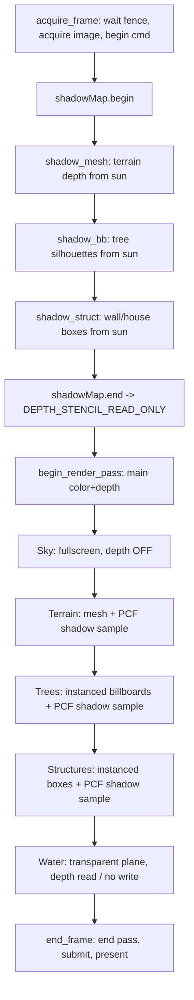

# Rendering — Timaert (Vulkan)

Source of truth for the **Vulkan render path**. Companion to
[vulkan.md](vulkan.md) (backend + GPU-assisted compute) and
[ARCHITECTURE.md](ARCHITECTURE.md) §Rendering & Compute Backend.

> **Status (2026-07-02).** All rendering below is implemented and validated in
> the **`gpu_smoke3d`** subworld harness (`validation=1`, 0 VUIDs). The shipping
> game (`timaert`) is still on the legacy OpenGL path; the P6 cutover replaces
> `src/gl/` + `imgui_impl_opengl3` with these passes wholesale. The 2D harness
> **`gpu_smoke`** exercises the macro fragment synth ([shaders/macro.frag](shaders/macro.frag)).

All backend objects live in `src/gpu/`; game logic never includes Vulkan
headers. Shaders are GLSL compiled to SPIR-V by `glslc` at build time (see
[vulkan.md](vulkan.md) §Shader toolchain).

---

## Frame structure

Each subworld frame is **two passes** recorded into one command buffer: a
depth-only **shadow pass** (scene from the sun's point of view) followed by the
**main pass** (scene from the camera). The split is why
[vk_renderer.h](src/gpu/vk_renderer.h) exposes `acquire_frame()` /
`begin_render_pass()` separately instead of only `begin_frame()`.



**Draw order and depth policy** (main pass):

| # | Pass | Pipeline | Depth test | Depth write | Blend |
|---|------|----------|-----------|-------------|-------|
| 1 | Sky | `create()` fullscreen | off | off | off |
| 2 | Terrain | `create_mesh()` | LESS | on | off |
| 3 | Trees | `create_mesh()` instanced | LESS | on | off (alpha-test discard) |
| 4 | Structures | `create_mesh()` instanced | LESS | on | off |
| 5 | Water | `create_mesh()` stride 0 | LESS | **off** | alpha |

Sky is drawn first as a backdrop; everything else depth-tests over it. Water is
last so it reads the terrain/tree/structure depth and blends without occluding
them.

---

## Dynamic lighting

Lighting is driven entirely by a **time-of-day** scalar `tod ∈ [0,1)` and is
**extensible** — every pass takes the same sun/ambient inputs, so adding a light
consumer is a push-constant field, not an engine change.

- **Sun direction** — `sunAng = (tod − 0.25)·2π`; `sunDir = (cos, sin, 0)`.
  Same convention as [shaders/sky.frag](shaders/sky.frag) so the visible sun disc
  and the lighting agree.
- **Sun colour** — warm orange near the horizon, neutral white overhead, scaled
  by a day-intensity `smoothstep` of the sun elevation (zero at night).
- **Ambient** — cool blue moonlight at night lerping to neutral grey by day, so
  night is **moonlit, never black**. Ambient is applied *unshadowed* (shadows
  only attenuate the sun term).

The shaded surface colour is:

```
col = base · (ambient.rgb + sunColor.rgb · NdotL · shadowFactor)
```

Terrain quantises `NdotL` to 4 bands for a pixel-retro look
([shaders/mesh.frag](shaders/mesh.frag)); trees use a flat `0.7` sun term
(billboards have no meaningful per-pixel normal).

The subworld game maps `tod` from `WorldTime`; see
[src/sub/lighting.h](src/sub/lighting.h) `compute_sun()` for the production
sun/colour curves this harness mirrors.

---

## Shadow mapping

This is the answer to the standing requirement: **no floating shadow blobs — cast
shadows must land on the terrain and on other objects.** We render a real
depth-map from the sun and sample it with PCF.

### Shadow resource — [vk_shadow.h](src/gpu/vk_shadow.h)

`gpu::VulkanShadowMap` owns one square depth target:

| Property | Value |
|----------|-------|
| Size | 2048×2048 |
| Format | `VK_FORMAT_D32_SFLOAT` |
| Usage | `DEPTH_STENCIL_ATTACHMENT` + `SAMPLED` |
| Sampler | `NEAREST`, clamp-to-edge |
| Render pass | depth-only, `CLEAR → STORE`, final layout `DEPTH_STENCIL_READ_ONLY_OPTIMAL` |
| Sync | two subpass dependencies (fragment-read ↔ depth-write) |

`begin(cmd)` opens the depth pass (clear depth = 1, viewport/scissor = size),
`end(cmd)` closes it and transitions the image to read-only so the main pass can
sample it.

### Light matrix

The sun is directional, so the shadow camera is an **orthographic** box aimed at
the scene centre:

```
lightEye  = center + sunDir · 20
lightView = lookAt(lightEye, center, up = (0,0,1))   // sunDir lies in the xy-plane
lightMvp  = ortho(-14..14, -14..14, 1..45) · lightView
```

`ortho`/`perspective` here are the harness-local **Vulkan-depth (0..1, Y-flip)**
helpers — `core/math.h` matrices are GL-style (depth −1..1) and must not be used
directly for Vulkan clip space.

### Depth-only pipeline — `create_shadow()` in [vk_pipeline.h](src/gpu/vk_pipeline.h)

- Colour blend `attachmentCount = 0` (no colour target).
- Depth test + write, compare `LESS`.
- **Depth bias** — constant `1.25`, slope `1.75` (peter-panning-safe front-face
  offset that removes most surface acne before PCF).
- Push constants `VERTEX | FRAGMENT`.

### Casters

| Caster | Vertex | Fragment |
|--------|--------|----------|
| Terrain | [shadow_mesh.vert](shaders/shadow_mesh.vert) — transform by `lightMvp` | [shadow_mesh.frag](shaders/shadow_mesh.frag) — empty (depth only) |
| Trees | [shadow_bb.vert](shaders/shadow_bb.vert) — expand instance quad along `lightRight` toward the sun | [shadow_bb.frag](shaders/shadow_bb.frag) — **shared** `treeCoverage()` `discard` (real silhouette) |
| NPCs | [shadow_npc.vert](shaders/shadow_npc.vert) — expand instance quad along `lightRight` | [shadow_npc.frag](shaders/shadow_npc.frag) — **shared** `npcCoverage()` `discard` (real silhouette) |
| Structures | [shadow_struct.vert](shaders/shadow_struct.vert) — expand the per-instance box (cube from `gl_VertexIndex`) by `lightMvp` | [shadow_struct.frag](shaders/shadow_struct.frag) — empty (depth only) |

**Universal billboard shadows (no bespoke silhouettes).** A billboard's shadow is
cast from its *own* sprite coverage, not a hand-authored silhouette. Each sprite's
coverage is a shared include ([tree_sprite.glsl](shaders/tree_sprite.glsl),
[npc_sprite.glsl](shaders/npc_sprite.glsl)) called by **both** the lit pass and
the depth-only caster — so any tree/NPC/mob casts a pixel-accurate shadow of its
actual shape with zero per-type shadow code. In the shipping game the coverage is
an atlas alpha sample, so **one** shadow shader serves every arbitrary sprite.

### Receivers (PCF sampling)

Terrain, trees, structures and NPCs bind the shadow map at **set 0, binding 0**
and sample it with a 3×3 PCF kernel. A fragment is lit when its light-space depth
(minus bias) is nearer than the stored depth:

- **Terrain** ([mesh.frag](shaders/mesh.frag)) samples **per-fragment** at
  `lightMvp · vWorld` with a **slope-scaled bias** `max(0.0015, 0.006·(1−NdotL))`.
- **Trees** ([billboard.frag](shaders/billboard.frag)) sample at the tree's
  **ground-contact base**, passed from the vertex stage as a `flat` varying
  (`vLightClip = lightMvp · iPos`). Because it is `flat`, the whole billboard
  shades as one unit — a tree in a mountain's shadow darkens uniformly with **no
  per-fragment self-shadow acne**. Constant bias `0.004`.
- **Structures** ([struct.frag](shaders/struct.frag)) sample **per-fragment** at
  `lightMvp · vWorld` with the same slope-scaled bias as the terrain (boxes have
  real face normals, so no billboard acne workaround is needed).

Result: terrain, trees and structures all **cast and receive**. Shadows fall on
the ground, across trees, and from walls/houses onto the terrain, and swing
through the day/night cycle because `lightMvp` tracks `sunDir` every frame.

### Extending shadows

- **New caster** — add a `create_shadow()` pipeline for the mesh and draw it
  inside `shadowMap.begin()/end()`. Give it the same `lightMvp`.
- **New receiver** — bind the shadow set (set 0, binding 0), push `lightMvp`,
  copy the `shadowFactor`/`treeShadow` helper, multiply the sun term by it.
- **Softer shadows / cascades** — widen the PCF kernel, or add a second
  `VulkanShadowMap` at a tighter ortho box and select by view distance. No API
  change beyond another descriptor binding.

---

## Sky and stars

[shaders/sky.frag](shaders/sky.frag) renders a **texture-free** procedural
celestial dome from a camera-basis push (`forward/right/up`, resolution, fov,
`tod`, fog colour, time). One fullscreen triangle
([fullscreen.vert](shaders/fullscreen.vert)), depth off, drawn first.

Layers: day/night/twilight gradient, sun disc + glow + horizon scatter, a moon,
**three equirectangular star densities** + a Milky-Way band (`dot(rd, mwN)`) +
per-star twinkle and colour temperature, and FBM clouds. This is intentionally
richer than the old baked star texture.

---

## Terrain and trees

- **Terrain** — a heightmap quad mesh (harness: 128×128 quads) with
  central-difference normals, indexed triangles, lit + shadowed as above. Vertex
  = `{vec3 pos, vec3 normal}`. Ground colour is a **procedural per-biome synth**
  ([shaders/mesh.frag](shaders/mesh.frag) `groundColor`): the biome is derived
  from elevation + a low-frequency moisture field (sand → grass/forest/swamp →
  dirt → rock → snow) and painted on a quantised pixel-art sub-grid — no atlas,
  same philosophy as the macro synth. In the shipping game the biome comes from
  the seamless tile grid ([src/sub/renderer_3d.h](src/sub/renderer_3d.h)); feed
  it in place of the derived bands.
- **Trees** — **instanced procedural billboards**. One `vkCmdDraw(6, treeCount)`
  draws the whole forest: the quad corners come from `gl_VertexIndex`, and a
  per-instance buffer supplies `{vec3 pos, size, species, seed}`. The fragment
  stage draws 7 species (pine/birch/willow/jungle/oak/cherry/autumn) **per pixel**
  keyed by species+seed — no atlas, no per-tree CPU cost, full variety. Camera
  facing is cylindrical (world-up stays vertical, right follows the camera). This
  same instanced pattern is the template for NPC paper-doll billboards.

## Water

[shaders/water.vert](shaders/water.vert) builds a flat quad at `waterLevel`
straight from `gl_VertexIndex` (no vertex buffer — the pipeline is created with
`vertexStride = 0`). [shaders/water.frag](shaders/water.frag) animates a wave
normal from two drifting noise fields, then adds a Fresnel sky reflection, a sun
specular glint, and a depth tint; output alpha `0.82`. Depth-test on,
depth-write off, alpha blend — so it fills valleys below the water line while
hills poke through.

## Structures (walls & houses)

City walls and houses render as **instanced boxes** — the same
geometry-from-`gl_VertexIndex` trick as the trees/water, so one
`vkCmdDraw(36, structCount)` draws the whole settlement with **no geometry vertex
buffer**. The per-instance buffer supplies `{vec3 centre, vec3 halfExtent, type,
seed}`; [struct.vert](shaders/struct.vert) builds a unit cube with outward face
normals and scales/translates it per instance. [struct.frag](shaders/struct.frag)
keys colour off `type` (stone wall vs. tan house body + red-brown roof band) and
lights it with the shared sun + ambient + PCF shadow. Walls and houses both cast
([shadow_struct.vert](shaders/shadow_struct.vert)) and receive shadows.

**Extensible by design:** a new structure kind (tower, gate, ruin, bridge) is one
more `type` value + one branch in the fragment stage — no new pipeline, no new
geometry. The shipping game feeds the real `Structure[]` records
([src/sub/map_data.h](src/sub/map_data.h)) — which already exist for walls,
houses and bridges — in place of the harness settlement, and can swap the box for
a pitched-roof or arbitrary mesh without touching the pass wiring.

---

## Push-constant layouts

All matrices + lighting travel as push constants (`VERTEX | FRAGMENT`).

| Pass | Struct | Bytes | Contents |
|------|--------|-------|----------|
| Macro synth | `Push` (macro.frag) | 32 | resolution, mapSize, viewCells, seaLevel, seed, time |
| Sky | `SkyPush` | 80 | forward, right, up, (resX,resY,fov,tod), (fogRGB,time) |
| Terrain | `MeshPush` | 176 | mvp, sunDir, sunColor, ambient, lightMvp |
| Trees | `BbPush` | 176 | mvp, camRight, sunColor, ambient, lightMvp |
| Structures | `MeshPush` (reused) | 176 | mvp, sunDir, sunColor, ambient, lightMvp |
| Water | `WaterPush` | 128 | mvp, camPos, sunDir, sunColor, (time,ambient,waterLevel,extent) |
| Shadow (mesh) | `ShadowPush` | 64 | lightMvp |
| Shadow (trees) | `ShadowBbPush` | 80 | lightMvp, lightRight |
| Shadow (struct) | `ShadowPush` (reused) | 64 | lightMvp |

> **Portability (P6).** MoltenVK allows 4096-byte pushes, so 176 B is fine on
> macOS. **AMD desktop caps `maxPushConstantsSize` at 128**, so the shipping game
> must move the per-frame matrices (mvp / lightMvp) into a **per-frame UBO** and
> keep only small per-draw data in the push. Plan this into the P6 cutover.

---

## Pipeline factory — [vk_pipeline.h](src/gpu/vk_pipeline.h)

One `gpu::VulkanPipeline` type, three constructors:

| Method | Use | Notes |
|--------|-----|-------|
| `create()` | Fullscreen fragment passes (macro synth, sky) | No vertex input; depth-stencil state present but disabled (valid against the depth render pass); optional descriptor-set layout |
| `create_mesh()` | Terrain, trees, structures, water | Vertex input binding (rate VERTEX or INSTANCE); depth test/write, optional blend, optional back-face cull, optional descriptor-set layout. **`vertexStride == 0` ⇒ no vertex input** (geometry from `gl_VertexIndex`, used by water) |
| `create_shadow()` | Depth-only casters | No colour attachment; depth bias; used inside the shadow pass |

Adding a pass = pick the right constructor, add the SPIR-V pair to the `glslc`
`foreach` in [CMakeLists.txt](CMakeLists.txt), record the draw in the correct
phase. No new pipeline abstraction needed.

---

## Design requirements (standing)

- **3D relief must match the 2D map.** The 2D view *is* the map / minimap (the
  macro synth — [shaders/macro.frag](shaders/macro.frag)) and must stay
  beautiful; the first-person 3D relief has to read as the **same** world,
  **especially mountains**. In the game both views consume the same macro
  heightmap, so the correspondence is structural — keep it that way (never invent
  3D relief the map does not show). Mountains are the sensitive case: tall and
  readable, never spiky aliasing.
- **Everything is extensible.** More biomes, landmarks and features are expected,
  and each adds render passes + context. Keep passes data-keyed (biome id,
  structure `type`, feature id) so growth is new table rows / new `type` values,
  not new engine branches.

## What is not implemented yet

Do not cite these as current visual evidence:

- **Real tile-grid biomes** on terrain (harness derives biome from height +
  moisture noise; the game feeds the seamless tile grid into the same synth).
- **NPC paper-doll** billboards (pattern ready; frag pending).
- **Richer structures** — walls + houses render as lit, shadowed boxes; pitched
  roofs, bridges and arbitrary `Structure` meshes still map onto the same pass.
- **Point lights** (torches/campfires) — [src/sub/lighting.h](src/sub/lighting.h)
  defines the `PointLight` POD and `kMaxPointLights`, but no upload path exists.

The **2D view is the map / minimap**, not a separate tile renderer to port — it
is already the macro synth ([shaders/macro.frag](shaders/macro.frag)); the
first-person 3D view is the subworld renderer.

See [vulkan.md](vulkan.md) for the backend module map and the GPU-driven
simulation plan.
