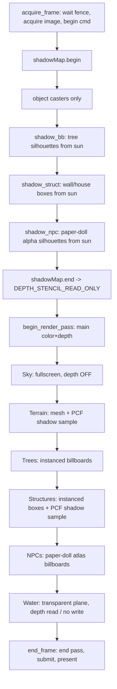

# Rendering — Timaert (Vulkan)

Source of truth for the **Vulkan render path**. Companion to
[vulkan.md](vulkan.md) (backend + GPU-assisted compute) and
[ARCHITECTURE.md](ARCHITECTURE.md) §Rendering & Compute Backend.

> **Status (2026-07-12).** The shipping game uses the Vulkan path for macro and
> subworld rendering. The subworld renderer has terrain, sky, water, structures,
> tree billboards, paper-doll NPC billboards, and one full-subworld directional
> shadow map. The 2D macro view is the macro fragment synth
> ([shaders/macro.frag](shaders/macro.frag)).

All backend objects live in `src/gpu/`; game logic never includes Vulkan
headers. Shaders are GLSL compiled to SPIR-V by `glslc` at build time (see
[vulkan.md](vulkan.md) §Shader toolchain).

---

## Frame structure

Each subworld frame is **two passes** recorded into one command buffer: a
depth-only **shadow pass** (scene from the sun's point of view) followed by the
**main pass** (scene from the camera). The split is why
[vk_renderer.h](src/gpu/vk_renderer.h) exposes `acquire_frame()` /
`begin_render_pass()` separately instead of only `begin_frame()`.



**Draw order and depth policy** (main pass):

| # | Pass | Pipeline | Depth test | Depth write | Blend |
|---|------|----------|-----------|-------------|-------|
| 1 | Sky | `create()` fullscreen | off | off | off |
| 2 | Terrain | `create_mesh()` | LESS | on | off |
| 3 | Trees | `create_mesh()` instanced | LESS | on | off (alpha-test discard) |
| 4 | Structures | `create_mesh()` instanced | LESS | on | off |
| 5 | NPCs | `create_mesh()` instanced | LESS | on | alpha |
| 6 | Water | `create_mesh()` stride 0 | LESS | **off** | alpha |

Sky is drawn first as a backdrop; everything else depth-tests over it. Water is
last so it reads existing depth and blends without occluding terrain, billboards,
or structures.

---

## Dynamic lighting

Lighting is driven entirely by a **time-of-day** scalar `tod ∈ [0,1)` and is
**extensible** — every pass takes the same sun/ambient inputs, so adding a light
consumer is a push-constant field, not an engine change.

- **Sun direction** — `sunAng = (tod − 0.25)·2π`; `sunDir = (cos, sin, 0)`.
  Shaded receivers use this as `L`, the direction **from the world toward the
  sun**, for `N·L`. Do not negate it when filling `MeshPush::sunDir`; negating it
  makes horizontal terrain receive no direct sun term, so ground shadows become
  invisible.
- **Sun colour** — warm orange near the horizon, neutral white overhead, scaled
  by a day-intensity `smoothstep` of the sun elevation (zero at night).
- **Ambient** — cool blue moonlight at night lerping to neutral grey by day, so
  night is **moonlit, never black**. Ambient is applied *unshadowed* (shadows
  only attenuate the sun term).

The shaded surface colour is:

```
col = base · (ambient.rgb + sunColor.rgb · NdotL · shadowFactor)
```

Terrain quantises `NdotL` to 4 bands for a pixel-retro look
([shaders/mesh.frag](shaders/mesh.frag)); trees use a flat `0.7` sun term
(billboards have no meaningful per-pixel normal).

The subworld game maps `tod` from `WorldTime`; see
[src/sub/lighting.h](src/sub/lighting.h) `compute_sun()` for the production
sun/colour curves this harness mirrors.

---

## Shadow mapping

This is the answer to the standing requirement: **no floating shadow blobs — cast
shadows must land on the terrain and on other objects.** We render a real
depth-map from the sun and sample it with PCF.

### Shadow resource — [vk_shadow.h](src/gpu/vk_shadow.h)

`gpu::VulkanShadowMap` owns one square depth target:

| Property | Value |
|----------|-------|
| Size | 4096×4096 |
| Format | `VK_FORMAT_D32_SFLOAT` |
| Usage | `DEPTH_STENCIL_ATTACHMENT` + `SAMPLED` |
| Sampler | `NEAREST`, clamp-to-edge |
| Render pass | depth-only, `CLEAR → STORE`, final layout `DEPTH_STENCIL_READ_ONLY_OPTIMAL` |
| Sync | two subpass dependencies (fragment-read ↔ depth-write) |

`begin(cmd)` opens the depth pass (clear depth = 1, viewport/scissor = size),
`end(cmd)` closes it and transitions the image to read-only so the main pass can
sample it.

### Light matrix

The sun is directional, so the shadow camera is an **orthographic** box in light
space. The production subworld uses one full-3×3-subworld shadow map instead of a
camera-centred bubble:

```
toSun    = normalize(sunDir)                  // world -> sun
fromSun  = -toSun                              // sun -> world
center   = (0, kHeightScale·0.45, 0)
lightEye = center - fromSun · 4200
lightMvp = vk_ortho(-2300..2300, -2300..2300, 0.5..9000) · lookAt(lightEye, center, lightUp)
```

`vk_ortho`/`vk_perspective` are the subworld-local **Vulkan-depth (0..1)** helpers
([src/sub/vk_camera_math.h](src/sub/vk_camera_math.h)); `core/math.h` projection
matrices are GL-style (depth −1..1) and must not be used directly for Vulkan clip
space.

### Depth-only pipeline — `create_shadow()` in [vk_pipeline.h](src/gpu/vk_pipeline.h)

- Colour blend `attachmentCount = 0` (no colour target).
- Depth test + write, compare `LESS`.
- Raster depth bias is **disabled**. Bias is applied in receiver shaders in the
  same normalized light-depth space as the shadow lookup; large raster bias on a
  full-subworld frustum erases small casters (NPCs/trees) via peter-panning.
- Push constants `VERTEX | FRAGMENT`.
- Optional descriptor set layout is supported for alpha-tested casters such as
  paper-doll NPCs.

### Casters

| Caster | Vertex | Fragment |
|--------|--------|----------|
| Trees | [shadow_bb.vert](shaders/shadow_bb.vert) — expand instance quad along sun-derived `lightRight` | [shadow_bb.frag](shaders/shadow_bb.frag) — shared `treeCoverage()` `discard` (real silhouette) |
| NPCs | [shadow_npc.vert](shaders/shadow_npc.vert) — expand instance quad along sun-derived `lightRight` | [shadow_npc.frag](shaders/shadow_npc.frag) — samples paper-doll `sampler2DArray` alpha and discards transparent pixels |
| Structures | [shadow_struct.vert](shaders/shadow_struct.vert) — expand the per-instance box (cube from `gl_VertexIndex`) by `lightMvp` | [shadow_struct.frag](shaders/shadow_struct.frag) — empty (depth only) |

**Universal billboard shadows (no bespoke silhouettes).** A billboard's shadow is
cast from its *own* visible coverage, not a hand-authored blob. Procedural trees
share `treeCoverage()` between lit and depth-only passes. Paper-doll NPCs use the
same composited 48×48 texture-array layer for lit rendering and shadow alpha, so
macro and micro NPCs come from the same character atlas and cast the current frame
silhouette. The same pattern should be reused for future sprite classes: lit pass
samples/draws coverage, shadow pass samples the same coverage and only writes
depth for opaque pixels.

### Receivers (PCF sampling)

Terrain and structures bind the shadow map at **set 0, binding 0** and sample it
with a 3×3 PCF kernel. A fragment is lit when its light-space depth (minus bias)
is nearer than the stored depth:

- **Terrain** ([mesh.frag](shaders/mesh.frag)) samples **per-fragment** at
  `lightMvp · vWorld` with normalized receiver bias
  `max(0.00008, 0.00035·(1−NdotL))`.
- **Structures** ([struct.frag](shaders/struct.frag)) sample **per-fragment** at
  `lightMvp · vWorld` with the same slope-scaled receiver bias as terrain.
- **Billboards** currently **cast but do not receive** shadow-map lighting. A flat
  billboard receiver sampled at one base point made whole sprites pop to black
  near other billboards. Future per-pixel billboard normals or sprite-depth cards
  can add receiving back without changing the shadow-map resource.

Result: terrain and structures receive PCF shadows; trees, structures, and NPCs
cast into the shared depth map. Terrain is intentionally not rendered as a caster
in this single full-subworld shadow map: self-shadowing the coarse receiver mesh
creates tile-scale zebra bands instead of useful object shadows. Shadows swing
through the day/night cycle because `lightMvp` tracks `sunDir` every frame.

### Extending shadows

- **New caster** — add a `create_shadow()` pipeline for the mesh and draw it
  inside `shadowMap.begin()/end()`. Give it the same `lightMvp`.
- **New receiver** — bind the shadow set (set 0, binding 0), push `lightMvp`,
  copy the `shadowFactor`/`treeShadow` helper, multiply the sun term by it.
- **Softer shadows / cascades** — widen the PCF kernel, or add a second
  `VulkanShadowMap` at a tighter ortho box and select by view distance. No API
  change beyond another descriptor binding.

---

## Sky and stars

[shaders/sky.frag](shaders/sky.frag) renders a **texture-free** procedural
celestial dome from a camera-basis push (`forward/right/up`, resolution, fov,
`tod`, fog colour, time). One fullscreen triangle
([fullscreen.vert](shaders/fullscreen.vert)), depth off, drawn first.

Layers: day/night/twilight gradient, sun disc + glow + horizon scatter, a moon,
**three equirectangular star densities** + a Milky-Way band (`dot(rd, mwN)`) +
per-star twinkle and colour temperature, and FBM clouds. This is intentionally
richer than the old baked star texture.

---

## Terrain and trees

- **Terrain** — a heightmap quad mesh (shipping: 192×192 quads, harness:
  128×128) with central-difference normals, indexed triangles, lit + shadowed as
  above. Vertex = `{vec3 pos, vec3 normal, vec2 uv}`, where `uv` is the
  normalised grid position (`0..1`). Ground colour is a **procedural per-biome
  synth** ([shaders/mesh.frag](shaders/mesh.frag) `groundColor`/`materialBase`),
  but the **material id that drives it is sampled per-fragment, not interpolated
  from the mesh vertices**. The renderer bakes a full-resolution R8 tile-material
  texture (`u_material`, descriptor **set 1**) in `upload()` — one texel per
  world tile, independent of the terrain tessellation — and the fragment stage
  looks it up at `vUv`.

  This is the fix for roads / field bands / shorelines rendering as
  **disconnected blobs (пятна)** instead of connected lines. The mesh is coarse
  — ~16 world tiles between vertices at 192² (more at the harness's 128²) — so a
  1-tile-wide road carried as a *per-vertex* material attribute simply falls
  between vertices and dissolves. Sampling the id *per-fragment* from the
  full-res grid keeps thin features crisp and continuous, exactly like the TS
  authority's per-fragment `u_tileGrid` lookup (`v_uv = a_pos` in renderer-3d).
  The synth then layers the quantised pixel-art per-material variation on top (no
  atlas, same philosophy as the macro synth). In the shipping game the ids come
  from the seamless tile grid ([src/sub/renderer_3d.h](src/sub/renderer_3d.h)),
  resolved once per biome cell while baking; the harness fakes a small grid
  (biome-by-height + a cross road) so the standalone smoke drives the identical
  path. The set-1 material descriptor is allocated once and rewritten on each
  `upload()` (load-time / seam-cross only — never per frame).

  *Next polish:* the per-material **surface** variation still reads
  "fabric-like" (a woven micro-pattern) rather than natural ground. The material
  routing above is correct and shipped; it is the texture synth inside
  `groundColor` that still needs a pass.
- **Trees** — **instanced procedural billboards**. One `vkCmdDraw(6, treeCount)`
  draws the whole forest: the quad corners come from `gl_VertexIndex`, and a
  per-instance buffer supplies `{vec3 pos, size, species, seed}`. The fragment
  stage draws 7 species (pine/birch/willow/jungle/oak/cherry/autumn) **per pixel**
  keyed by species+seed — no atlas, no per-tree CPU cost, full variety. Camera
  facing is cylindrical (world-up stays vertical, right follows the camera).
  The macro-map tree decor in [macro.frag](shaders/macro.frag) intentionally keeps
  the old irregular single-cell blob as the visual base, then uses the project's
  3×3 context rule only to add small neighbouring crown caps across shared
  forest edges/corners. That preserves crisp organic tree shapes, avoids square
  forest fills or one-direction smears, and lets neighbouring biomes/temperatures
  mix their tree colours naturally on forest borders.
- **NPCs** — **instanced paper-doll billboards**. The micro-world uses the same
  composited character atlas frames as the macro overlay via
  `character::PaperdollAtlas` + `gpu::SpriteArray` (48×48 `sampler2DArray`).
  `prepare_frame()` resolves the current `AnimationState` (`Idle`/`Walk` plus
  direction from `SubworldAi::vx/vy`), uploads any newly composed layers before
  the render pass, and fills the NPC instance buffer with `{pos, size, layer}`.
  The lit pass samples [shaders/npc.frag](shaders/npc.frag); the shadow pass
  samples the same layer alpha in [shaders/shadow_npc.frag](shaders/shadow_npc.frag).

## Water

[shaders/water.vert](shaders/water.vert) builds a flat quad at `waterLevel`
straight from `gl_VertexIndex` (no vertex buffer — the pipeline is created with
`vertexStride = 0`). [shaders/water.frag](shaders/water.frag) animates a wave
normal from two drifting noise fields, then adds a Fresnel sky reflection, a sun
specular glint, and a depth tint; output alpha `0.82`. Depth-test on,
depth-write off, alpha blend — so it fills valleys below the water line while
hills poke through.

## Structures (walls & houses)

City walls and houses render as **instanced boxes** — the same
geometry-from-`gl_VertexIndex` trick as the trees/water, so one
`vkCmdDraw(36, structCount)` draws the whole settlement with **no geometry vertex
buffer**. The per-instance buffer supplies `{vec3 centre, vec3 halfExtent, type,
seed}`; [struct.vert](shaders/struct.vert) builds a unit cube with outward face
normals and scales/translates it per instance. [struct.frag](shaders/struct.frag)
keys colour off `type` (stone wall vs. tan house body + red-brown roof band) and
lights it with the shared sun + ambient + PCF shadow. Walls and houses both cast
([shadow_struct.vert](shaders/shadow_struct.vert)) and receive shadows.

**Extensible by design:** a new structure kind (tower, gate, ruin, bridge) is one
more `type` value + one branch in the fragment stage — no new pipeline, no new
geometry. The shipping game feeds the real `Structure[]` records
([src/sub/map_data.h](src/sub/map_data.h)) — which already exist for walls,
houses and bridges — in place of the harness settlement, and can swap the box for
a pitched-roof or arbitrary mesh without touching the pass wiring.

---

## Push-constant layouts

All matrices + lighting travel as push constants (`VERTEX | FRAGMENT`).

| Pass | Struct | Bytes | Contents |
|------|--------|-------|----------|
| Macro synth | `Push` (macro.frag) | 32 | resolution, mapSize, viewCells, seaLevel, seed, time |
| Sky | `SkyPush` | 80 | forward, right, up, (resX,resY,fov,tod), (fogRGB,time) |
| Terrain | `MeshPush` | 176 | mvp, sunDir, sunColor, ambient, lightMvp |
| Trees | `BbPush` | 176 | mvp, camRight, sunColor, ambient, lightMvp |
| Structures | `MeshPush` (reused) | 176 | mvp, sunDir, sunColor, ambient, lightMvp |
| Water | `WaterPush` | 128 | mvp, camPos, sunDir, sunColor, (time,ambient,waterLevel,extent) |
| Shadow (mesh) | `ShadowPush` | 64 | lightMvp |
| Shadow (trees) | `ShadowBbPush` | 80 | lightMvp, lightRight |
| Shadow (struct) | `ShadowPush` (reused) | 64 | lightMvp |
| Shadow (NPC) | `ShadowBbPush` | 80 | lightMvp, lightRight |

> **Portability.** MoltenVK allows 4096-byte pushes, so 176 B is fine on macOS.
> **AMD desktop caps `maxPushConstantsSize` at 128**, so before broad Windows/GPU
> support the per-frame matrices (mvp / lightMvp) should move into a per-frame UBO,
> keeping only small per-draw data in push constants.

---

## Pipeline factory — [vk_pipeline.h](src/gpu/vk_pipeline.h)

One `gpu::VulkanPipeline` type, three constructors:

| Method | Use | Notes |
|--------|-----|-------|
| `create()` | Fullscreen fragment passes (macro synth, sky) | No vertex input; depth-stencil state present but disabled (valid against the depth render pass); optional descriptor-set layout |
| `create_mesh()` | Terrain, trees, structures, NPCs, water | Vertex input binding (rate VERTEX or INSTANCE); depth test/write, optional blend, optional back-face cull, one or more descriptor-set layouts. **`vertexStride == 0` ⇒ no vertex input** (geometry from `gl_VertexIndex`, used by water) |
| `create_shadow()` | Depth-only casters | No colour attachment; optional descriptor-set layout for alpha-tested sprite casters; used inside the shadow pass |

Adding a pass = pick the right constructor, add the SPIR-V pair to the `glslc`
`foreach` in [CMakeLists.txt](CMakeLists.txt), record the draw in the correct
phase. No new pipeline abstraction needed.

---

## Design requirements (standing)

- **3D relief must match the 2D map.** The 2D view *is* the map / minimap (the
  macro synth — [shaders/macro.frag](shaders/macro.frag)) and must stay
  beautiful; the first-person 3D relief has to read as the **same** world,
  **especially mountains**. In the game both views consume the same macro
  heightmap, so the correspondence is structural — keep it that way (never invent
  3D relief the map does not show). Mountains are the sensitive case: tall and
  readable, never spiky aliasing.
- **Everything is extensible.** More biomes, landmarks and features are expected,
  and each adds render passes + context. Keep passes data-keyed (biome id,
  structure `type`, feature id) so growth is new table rows / new `type` values,
  not new engine branches.

## What is not implemented yet

Do not cite these as current visual evidence:

- **Terrain surface synth** — the material *id* is now sampled per-fragment from
  the full-resolution tile grid (see §Terrain and trees), so roads/fields/
  shorelines are crisp and connected. What remains is the per-material **surface
  texture**: it still reads "fabric-like" (a woven micro-pattern) rather than
  natural ground. This is a `groundColor` synth polish, not a data-routing gap.
- **Billboard shadow receiving** is intentionally disabled for now. Billboards cast
  silhouettes into the shadow map, but only terrain/structures receive PCF shadows;
  the old flat base-point receive path made whole sprites pop to black.
- **Richer structures** — walls + houses render as lit, shadowed boxes; pitched
  roofs, bridges and arbitrary `Structure` meshes still map onto the same pass.
- **Point lights** (torches/campfires) — [src/sub/lighting.h](src/sub/lighting.h)
  defines the `PointLight` POD and `kMaxPointLights`, but no upload path exists.

The **2D view is the map / minimap**, not a separate tile renderer to port — it
is already the macro synth ([shaders/macro.frag](shaders/macro.frag)); the
first-person 3D view is the subworld renderer.

See [vulkan.md](vulkan.md) for the backend module map and the GPU-driven
simulation plan.
